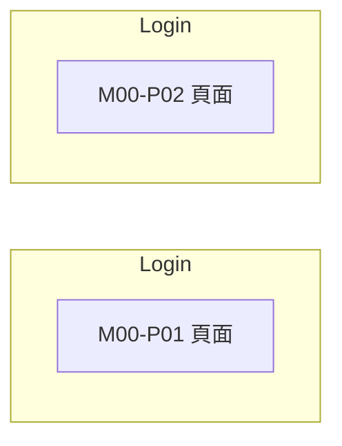

# M00 登入與錯誤頁(Auth / System)— 模塊內容與操作流程(產品)

> 資料來源:後台前端程式(版本 2.8.2)靜態分析,並於 2026-10-05 以人工登入帳號實機只讀查驗(選單依該帳號角色)。各頁查驗結果見 04 測試報告。

## 模塊說明

後台登入(一般登入、PAGCOR 登入)與無權限提示頁。

## 頁面一覽

| 頁面 | 名稱 | 類型 | 路由 | 主要操作 |
|---|---|---|---|---|
| M00-P01 | Login | 頁面 | `/login` |  |
| M00-P02 | Login | 頁面 | `/login-pagcor` |  |

## 頁面流程圖

## 頁面內容與操作說明

### M00-P01 Login(頁面)

- 路由:`/login`  權限:`登入即可`
- 功能點:M00-F01 頁面
- 表單欄位:Email or Username、Password、Remember me(欄位規則見 03 開發欄位控制)
- 選單位置:❌ 不在選單;實機狀態:未查驗

### M00-P02 Login(頁面)

- 路由:`/login-pagcor`  權限:`登入即可`
- 功能點:M00-F02 頁面
- 表單欄位:Email or Username、Password(欄位規則見 03 開發欄位控制)
- 選單位置:❌ 不在選單;實機狀態:未查驗

