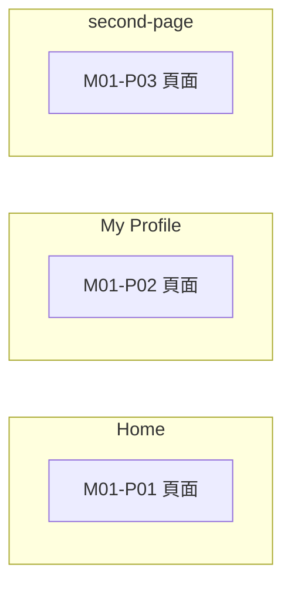

# M01 首頁與帳號(Home / Account)— 模塊內容與操作流程(產品)

> 資料來源:後台前端程式(版本 2.8.2)靜態分析,並於 2026-10-05 以人工登入帳號實機只讀查驗(選單依該帳號角色)。各頁查驗結果見 04 測試報告。

## 模塊說明

後台登入後的首頁,以及管理員修改自己的密碼(右上角個人選單進入)。

## 頁面一覽

| 頁面 | 名稱 | 類型 | 路由 | 主要操作 |
|---|---|---|---|---|
| M01-P01 | Home | 頁面 | `/` |  |
| M01-P02 | My Profile | 頁面 | `/profile` |  |
| M01-P03 | second-page | 頁面 | `/second-page` |  |

## 頁面流程圖

## 頁面內容與操作說明

### M01-P01 Home(頁面)

- 路由:`/`  權限:`登入即可`
- 功能點:M01-F01 頁面
- 選單位置:✅ 選單;實機狀態:✅ 一致;截圖(本機,不進 git):`.playwright-output/live/home.png`

### M01-P02 My Profile(頁面)

- 路由:`/profile`  權限:`登入即可`
- 功能點:M01-F02 頁面
- 頁面說明:上方顯示自己的 Name、Email、Role(唯讀),下方修改密碼
- 表單欄位:Current Password、New Password、Confirm New Password(欄位規則見 03 開發欄位控制)
- 系統提示:「Profile not found」、「Password Changed successfully」、「Error changing password: {error}」
- 選單位置:個人選單;實機狀態:✅ 一致;截圖(本機,不進 git):`.playwright-output/live/profile.png`

### M01-P03 second-page(頁面)

- 路由:`/second-page`  權限:`view:users`
- 功能點:M01-F03 頁面
- 選單位置:❌ 不在選單;實機狀態:✅ 一致;截圖(本機,不進 git):`.playwright-output/live/second-page.png`

