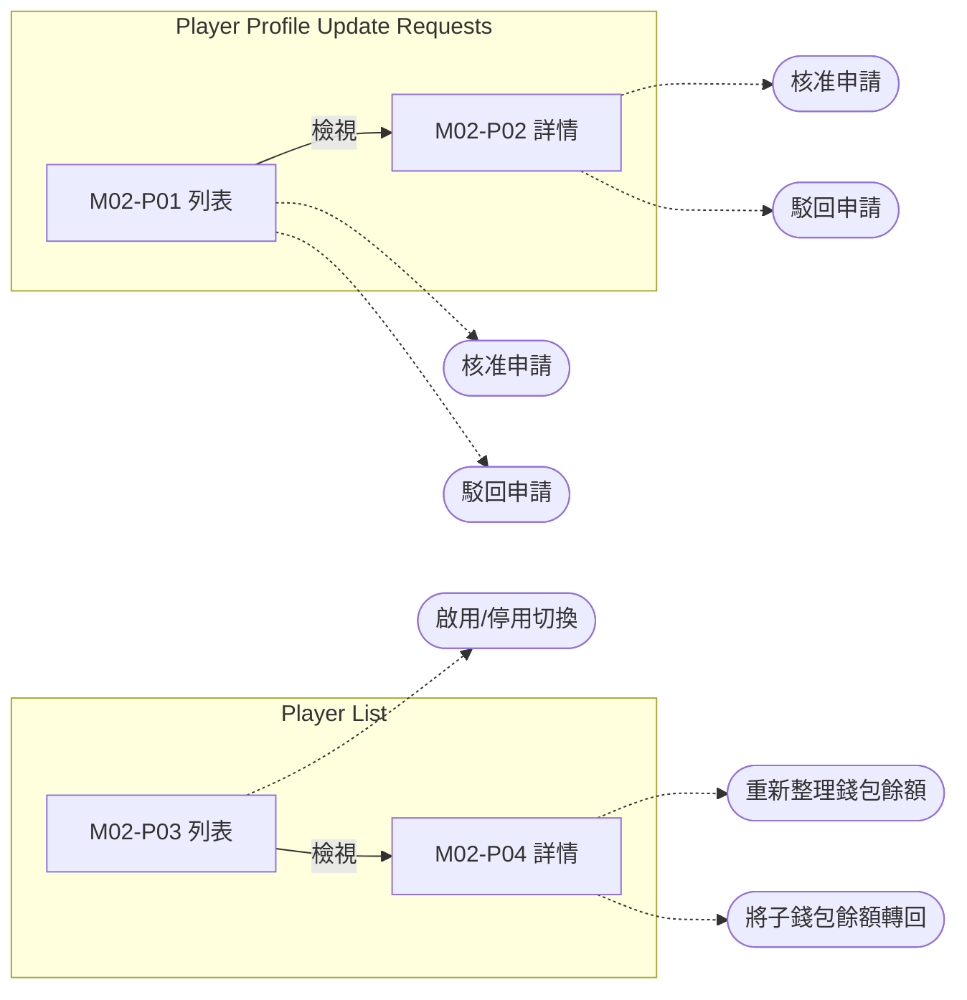

# M02 玩家管理(Player Management)— 模塊內容與操作流程(產品)

> 資料來源:後台前端程式(版本 2.8.2)靜態分析,並於 2026-10-05 以人工登入帳號實機只讀查驗(選單依該帳號角色)。各頁查驗結果見 04 測試報告。

## 模塊說明

查詢玩家清單與詳情(含各錢包餘額、轉回主錢包),停用/啟用玩家,審核玩家提出的個人資料修改申請。

## 頁面一覽

| 頁面 | 名稱 | 類型 | 路由 | 主要操作 |
|---|---|---|---|---|
| M02-P01 | Player Profile Update Requests | 列表 | `/player-profile-update-requests/list` | Clear、Search、View、Cancel、Confirm |
| M02-P02 | Player Profile Update Requests | 詳情 | `/player-profile-update-requests/view/:id` | Back、Cancel、Confirm |
| M02-P03 | Player List | 列表 | `/players/list` | Clear、Search、View |
| M02-P04 | players | 詳情 | `/players/view/:id` | Refresh、Transfer |

## 頁面流程圖

## 頁面內容與操作說明

### M02-P01 Player Profile Update Requests(列表)

- 路由:`/player-profile-update-requests/list`  權限:`view:player-profile-update-requests`
- 功能點:M02-F01 查詢列表、M02-F02 欄位排序、M02-F03 分頁、M02-F04 核准申請、M02-F05 駁回申請
- 表格欄位:Request No.、Player ID、Player Name、Request Type、Status、Submitted At、Actions
- 條件顯示的欄位:Admin Password(核准/駁回確認對話框內,需輸入管理員密碼)、Rejection Reason(駁回對話框內)
- 篩選條件:Player ID、Request Type、Status、Start Date ~ End Date、Items per page、Admin Password、Rejection Reason(欄位規則見 03 開發欄位控制)
- 系統提示:「Request approved successfully」、「Failed to approve request」、「Request rejected successfully」、「Failed to reject request」
- 選單位置:✅ 選單;實機狀態:✅ 一致;截圖(本機,不進 git):`.playwright-output/live/player-profile-update-requests_list.png`

**操作步驟**

1. 從側欄選單進入本頁,系統載入第一頁資料(/player/profile-update-request)
2. 輸入篩選條件後按「Search」查詢;按「Clear」清除條件
3. 點欄位標題排序
4. 核准申請(POST /player/profile-update-request/:id/approve)
5. 駁回申請(POST /player/profile-update-request/:id/reject)

### M02-P02 Player Profile Update Requests(詳情)

- 路由:`/player-profile-update-requests/view/:id`  權限:`view:player-profile-update-requests`
- 功能點:M02-F06 檢視詳情、M02-F07 核准申請、M02-F08 駁回申請
- 顯示內容(實機):Request No.、Player ID、Player Name、Request Type、Status、Submitted At、Reason、Current Value、New Value
- 條件顯示的欄位:Admin Password(核准/駁回確認對話框內,需輸入管理員密碼)、Rejection Reason(駁回對話框內)
- 表單欄位:Admin Password、Rejection Reason(欄位規則見 03 開發欄位控制)
- 系統提示:「Request approved successfully」、「Failed to approve request」、「Request rejected successfully」、「Failed to reject request」
- 選單位置:由列表進入;實機狀態:✅ 一致;截圖(本機,不進 git):`.playwright-output/live/player-profile-update-requests_view_id.png`

**操作步驟**

1. 由列表按「View」進入,系統載入單筆資料(/player/profile-update-request/:id)
2. 核准申請(POST /player/profile-update-request/:id/approve)
3. 駁回申請(POST /player/profile-update-request/:id/reject)

### M02-P03 Player List(列表)

- 路由:`/players/list`  權限:`view:players`
- 功能點:M02-F09 查詢列表、M02-F10 欄位排序、M02-F11 分頁、M02-F12 啟用/停用切換
- 表格欄位:ID、Player ID、Email、Status、Referral Code、Upline、Actions
- 篩選條件:Player ID、Email、Status、Items per page(欄位規則見 03 開發欄位控制)
- 系統提示:「Player status changed successfully」
- 選單位置:✅ 選單;實機狀態:✅ 一致;截圖(本機,不進 git):`.playwright-output/live/players_list.png`

**操作步驟**

1. 從側欄選單進入本頁,系統載入第一頁資料(/players)
2. 輸入篩選條件後按「Search」查詢;按「Clear」清除條件
3. 點欄位標題排序
4. 啟用/停用切換(PUT /players/status/:id)

### M02-P04 players(詳情)

- 路由:`/players/view/:id`  權限:`view:players`
- 功能點:M02-F13 檢視詳情、M02-F14 重新整理錢包餘額、M02-F15 將子錢包餘額轉回
- 頁面說明:分 Player Details、Wallet Details 兩個頁籤;錢包表格在 Wallet Details 頁籤
- 表格欄位:Wallet Id、Wallet Name、Balance、Created At、Updated At、Actions
- 顯示內容(實機):ID、Player ID、Status、Email、Referral Code、Upline
- 系統提示:「Wallet transferred back successfully」
- 選單位置:由列表進入;實機狀態:✅ 一致;截圖(本機,不進 git):`.playwright-output/live/players_view_id.png`

**操作步驟**

1. 由列表按「View」進入,系統載入單筆資料(/players/:id/wallets、/players/:id、/players/:id/wallets/transfer_back)
2. 重新整理錢包餘額(POST /players/:id/wallets/refresh)

