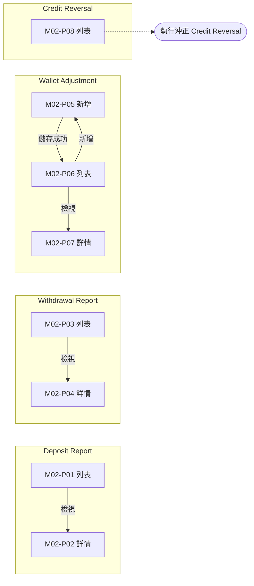
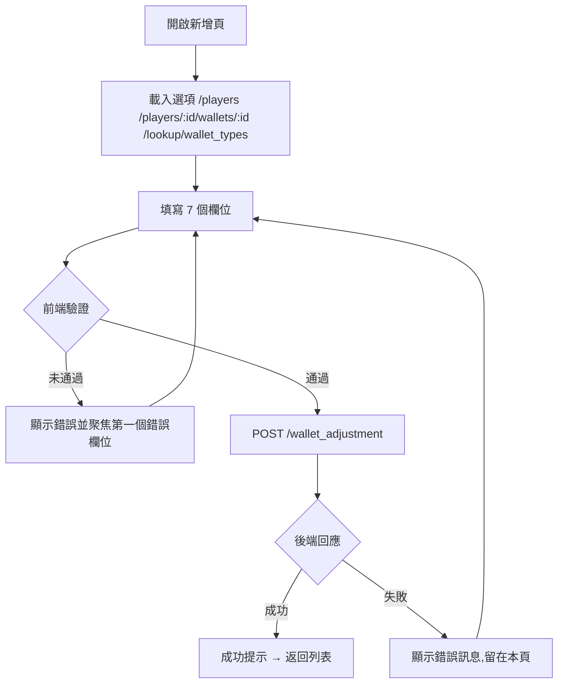

# M02 錢包管理(Wallets Management)— 模塊內容與操作流程(產品)

> 資料來源:後台前端程式(版本 2.8.2)靜態分析,2026-10-05。尚未經登入後實際畫面查驗的內容,狀態標為「待實機查驗」。

## 模塊說明

處理玩家錢包的人工調帳與沖正(Credit Reversal),以及查詢存款、提款交易紀錄。屬於資金異動模塊,操作會直接影響玩家餘額。

## 頁面一覽

| 頁面 | 名稱 | 類型 | 路由 | 主要操作 |
|---|---|---|---|---|
| M02-P01 | Deposit Report | 列表 | `/reports/deposit/list` | Clear、Download CSV、Search、View |
| M02-P02 | Deposit Log | 詳情 | `/reports/deposit/view/:id` |  |
| M02-P03 | Withdrawal Report | 列表 | `/reports/withdrawal/list` | Clear、Download CSV、Search、View |
| M02-P04 | Withdrawal Log | 詳情 | `/reports/withdrawal/view/:id` |  |
| M02-P05 | wallets / adjustment | 新增 | `/wallets/adjustment/add` | Cancel、Save |
| M02-P06 | Wallet Adjustment | 列表 | `/wallets/adjustment/list` | Clear、Search、View |
| M02-P07 | wallets / adjustment | 詳情 | `/wallets/adjustment/view/:id` |  |
| M02-P08 | Credit Reversal | 列表 | `/wallets/refund/list` | Clear、Search |

## 頁面流程圖

## 頁面內容與操作說明

### M02-P01 Deposit Report(列表)

- 路由:`/reports/deposit/list`  權限:`view:deposit-report`
- 功能點:M02-F01 查詢列表、M02-F02 欄位排序、M02-F03 分頁、M02-F04 匯出
- 表格欄位:Player ID、Bank Name、Request UUID、Transaction ID、Reference ID、Amount、Status、Remarks、Created At、Actions
- 篩選條件:Deposit Report、Player ID、Transaction ID、Reference ID、Bank Name、Status、Request UUID、Items per page(欄位規則見 03 開發欄位控制)
- 實機狀態:待實機查驗

**操作步驟**

1. 從側欄選單進入本頁,系統載入第一頁資料(/report/deposit/list、/report/bank/list)
2. 輸入篩選條件後按「Search」查詢;按「Clear」清除條件
3. 點欄位標題排序
4. 按「Download CSV / Download」匯出目前查詢結果

### M02-P02 Deposit Log(詳情)

- 路由:`/reports/deposit/view/:id`  權限:`view:deposit-report`
- 功能點:M02-F05 檢視詳情
- 實機狀態:待實機查驗

**操作步驟**

1. 由列表按「View」進入,系統載入單筆資料(/report/deposit/:id)

### M02-P03 Withdrawal Report(列表)

- 路由:`/reports/withdrawal/list`  權限:`view:withdrawal-report`
- 功能點:M02-F06 查詢列表、M02-F07 欄位排序、M02-F08 分頁、M02-F09 匯出
- 表格欄位:Player ID、Bank Name、Request UUID、Transaction ID、Reference ID、Amount、Status、Remarks、Created At、Actions
- 篩選條件:Withdrawal Report、Player ID、Transaction ID、Reference ID、Bank Name、Status、Request UUID、Items per page(欄位規則見 03 開發欄位控制)
- 實機狀態:待實機查驗

**操作步驟**

1. 從側欄選單進入本頁,系統載入第一頁資料(/report/withdraw/list、/report/bank/list)
2. 輸入篩選條件後按「Search」查詢;按「Clear」清除條件
3. 點欄位標題排序
4. 按「Download CSV / Download」匯出目前查詢結果

### M02-P04 Withdrawal Log(詳情)

- 路由:`/reports/withdrawal/view/:id`  權限:`view:withdrawal-report`
- 功能點:M02-F10 檢視詳情
- 實機狀態:待實機查驗

**操作步驟**

1. 由列表按「View」進入,系統載入單筆資料(/report/withdraw/:id)

### M02-P05 wallets / adjustment(新增)

- 路由:`/wallets/adjustment/add`  權限:`create:wallet-adjustment`
- 功能點:M02-F11 新增
- 表單欄位:Adjustment Reason、Player ID、Wallet Type、Current Balance、Amount Debit (+)、Amount Credit (-)、New Balance(欄位規則見 03 開發欄位控制)
- 系統提示:「Wallet adjustment created successfully」
- 實機狀態:待實機查驗

**操作步驟**

1. 開啟新增頁,系統載入下拉選項(/players、/players/:id/wallets/:id、/lookup/wallet_types)
2. 依序填寫欄位(必填欄位標示 *)
3. 按「Save」送出;前端驗證未通過時,游標跳到第一個錯誤欄位並顯示錯誤訊息
4. 驗證通過後送出 POST /wallet_adjustment
5. 成功:顯示成功提示並返回列表;失敗:顯示後端回傳的錯誤訊息,留在本頁
6. 按「Cancel」放棄並返回上一頁

### M02-P06 Wallet Adjustment(列表)

- 路由:`/wallets/adjustment/list`  權限:`view:wallet-adjustment`
- 功能點:M02-F12 查詢列表、M02-F13 欄位排序、M02-F14 分頁
- 表格欄位:ID、Player ID、Wallet、Balance Before、Balance After、Amount Debit (+)、Amount Credit (-)、Adjusted By、Created At、Action
- 篩選條件:Player ID、Wallet Type、Wallet Type、Wallet Type(欄位規則見 03 開發欄位控制)
- 實機狀態:待實機查驗

**操作步驟**

1. 從側欄選單進入本頁,系統載入第一頁資料(/lookup/wallet_types、/wallet_adjustment)
2. 輸入篩選條件後按「Search」查詢;按「Clear」清除條件
3. 點欄位標題排序

### M02-P07 wallets / adjustment(詳情)

- 路由:`/wallets/adjustment/view/:id`  權限:`view:wallet-adjustment`
- 功能點:M02-F15 檢視詳情
- 實機狀態:待實機查驗

**操作步驟**

1. 由列表按「View」進入,系統載入單筆資料(/wallet_adjustment/:id)

### M02-P08 Credit Reversal(列表)

- 路由:`/wallets/refund/list`  權限:`view:wallets-refund`
- 功能點:M02-F16 查詢列表、M02-F17 欄位排序、M02-F18 分頁、M02-F19 執行沖正(Credit Reversal)
- 表格欄位:ID、Player ID、Transaction Ref ID、Amount、Status、Created At、Action
- 篩選條件:Credit Reversal、Credit Reversal、Credit Reversal、per_page(欄位規則見 03 開發欄位控制)
- 實機狀態:待實機查驗

**操作步驟**

1. 從側欄選單進入本頁,系統載入第一頁資料
2. 輸入篩選條件後按「Search」查詢;按「Clear」清除條件
3. 點欄位標題排序
4. 執行沖正(Credit Reversal)(PUT /wallets/refund/:id)

