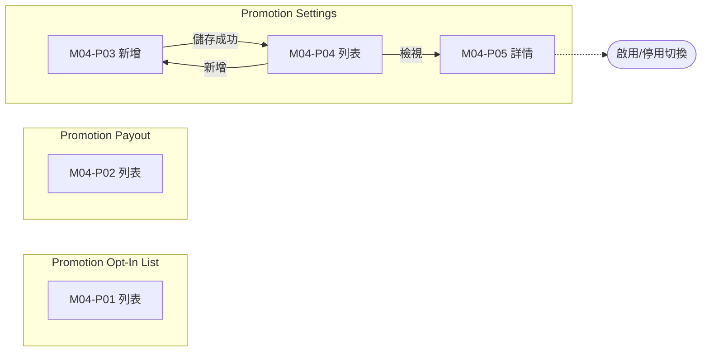
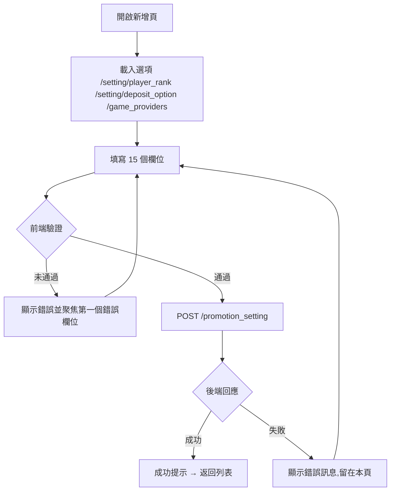

# M04 促銷活動(Promotions)— 模塊內容與操作流程(產品)

> 資料來源:後台前端程式(版本 2.8.2)靜態分析,並於 2026-10-05 以人工登入帳號實機只讀查驗(選單依該帳號角色)。各頁查驗結果見 04 測試報告。

## 模塊說明

設定存款類促銷活動(期間、適用等級、存款條件、派彩方式與頻率、流水要求),查看玩家報名(Opt-In)名單與派彩紀錄。

## 頁面一覽

| 頁面 | 名稱 | 類型 | 路由 | 主要操作 |
|---|---|---|---|---|
| M04-P01 | Promotion Opt-In List | 列表 | `/promotions/opt-in/list` | Clear、Download CSV、Search、View |
| M04-P02 | Promotion Payout | 列表 | `/promotions/payout/list` | Clear、Download CSV、Search、View |
| M04-P03 | promotions / settings | 新增 | `/promotions/settings/add` | Cancel、Save |
| M04-P04 | Promotion Settings | 列表 | `/promotions/settings/list` | Clear、Search、View |
| M04-P05 | promotions / settings | 詳情 | `/promotions/settings/view/:id` | Activate、Deactivate |

## 頁面流程圖

## 頁面內容與操作說明

### M04-P01 Promotion Opt-In List(列表)

- 路由:`/promotions/opt-in/list`  權限:`view:promotions-opt-in`
- 功能點:M04-F01 查詢列表、M04-F02 欄位排序、M04-F03 分頁、M04-F04 匯出
- 表格欄位:ID、Player ID、Promotion Name、Game Provider、Min/Max Deposit、Deposit Information、Turnover Information、Tier Points Information、Join Date、Payment Method、Created At、Updated At
- 篩選條件:Search Player ID、Search Promotion Name、Items per page(欄位規則見 03 開發欄位控制)
- 選單位置:✅ 選單;實機狀態:✅ 一致;截圖(本機,不進 git):`.playwright-output/live/promotions_opt-in_list.png`

**操作步驟**

1. 從側欄選單進入本頁,系統載入第一頁資料(/promotion_opt_in)
2. 輸入篩選條件後按「Search」查詢;按「Clear」清除條件
3. 點欄位標題排序
4. 按「Download CSV / Download」匯出目前查詢結果

### M04-P02 Promotion Payout(列表)

- 路由:`/promotions/payout/list`  權限:`view:promotions-payout`
- 功能點:M04-F05 查詢列表、M04-F06 欄位排序、M04-F07 分頁、M04-F08 匯出
- 表格欄位:ID、Player ID、Promotion Name、Payout Amount、Payout Method、Payout Date、Status
- 篩選條件:Search Player ID、Search Promotion Name、Items per page(欄位規則見 03 開發欄位控制)
- 選單位置:✅ 選單;實機狀態:✅ 一致;截圖(本機,不進 git):`.playwright-output/live/promotions_payout_list.png`

**操作步驟**

1. 從側欄選單進入本頁,系統載入第一頁資料(/promotion_payout)
2. 輸入篩選條件後按「Search」查詢;按「Clear」清除條件
3. 點欄位標題排序
4. 按「Download CSV / Download」匯出目前查詢結果

### M04-P03 promotions / settings(新增)

- 路由:`/promotions/settings/add`  權限:`create:promotions-settings`
- 功能點:M04-F09 新增
- 表單欄位:Promotion Name、Start Date ~ End Date、Player Ranking、Deposit Option、Minimum Deposit、Maximum Deposit、Payout Frequency、Vendors、Terms and Conditions、Payout Method、Percentage(%)、Max Campaign Amount、Turnover Amount、Earn Points(Tier Points)、Banner(欄位規則見 03 開發欄位控制)
- 系統提示:「Promotion created successfully」、「Error creating promotion」
- 選單位置:由列表進入;實機狀態:✅ 一致;截圖(本機,不進 git):`.playwright-output/live/promotions_settings_add.png`

**操作步驟**

1. 開啟新增頁,系統載入下拉選項(/setting/player_rank、/setting/deposit_option、/game_providers)
2. 依序填寫欄位(必填欄位標示 *)
3. 按「Save」送出;前端驗證未通過時,游標跳到第一個錯誤欄位並顯示錯誤訊息
4. 驗證通過後送出 POST /promotion_setting
5. 成功:顯示成功提示並返回列表;失敗:顯示後端回傳的錯誤訊息,留在本頁
6. 按「Cancel」放棄並返回上一頁

### M04-P04 Promotion Settings(列表)

- 路由:`/promotions/settings/list`  權限:`view:promotions-settings`
- 功能點:M04-F10 查詢列表、M04-F11 欄位排序、M04-F12 分頁
- 表格欄位:ID、Promotion Name、Start Date、End Date、Payout Frequency、Created At、Updated At、Actions
- 篩選條件:Search Promotion Name、Search Payout Frequency、Start Date (FROM) ~ Start Date (TO)、Items per page(欄位規則見 03 開發欄位控制)
- 選單位置:✅ 選單;實機狀態:✅ 一致;截圖(本機,不進 git):`.playwright-output/live/promotions_settings_list.png`

**操作步驟**

1. 從側欄選單進入本頁,系統載入第一頁資料(/promotion_setting)
2. 輸入篩選條件後按「Search」查詢;按「Clear」清除條件
3. 點欄位標題排序

### M04-P05 promotions / settings(詳情)

- 路由:`/promotions/settings/view/:id`  權限:`view:promotions-settings`
- 功能點:M04-F13 檢視詳情、M04-F14 啟用/停用切換
- 顯示內容(實機):Promotion Name、Start Date、End Date、Player Ranking、Deposit Option、Minimum Amount、Maximum Amount、Payout Frequency、Vendors、Terms and Conditions、Payment Method、Percentage、Max Campaign Amount、Turnover Amount、Tier Points、Created By、Created At、Updated By、Updated At、Banner
- 條件顯示的欄位:Email(按 Activate / Deactivate 後的確認對話框內,需輸入管理員帳密)、Password(按 Activate / Deactivate 後的確認對話框內,需輸入管理員帳密)
- 表單欄位:Email、Password(欄位規則見 03 開發欄位控制)
- 系統提示:「Promotion activated successfully」、「Promotion deactivated successfully」
- 選單位置:由列表進入;實機狀態:✅ 一致;截圖(本機,不進 git):`.playwright-output/live/promotions_settings_view_id.png`

**操作步驟**

1. 由列表按「View」進入,系統載入單筆資料(/promotion_setting/:id)
2. 啟用/停用切換(POST /promotion_setting/status/:id)

