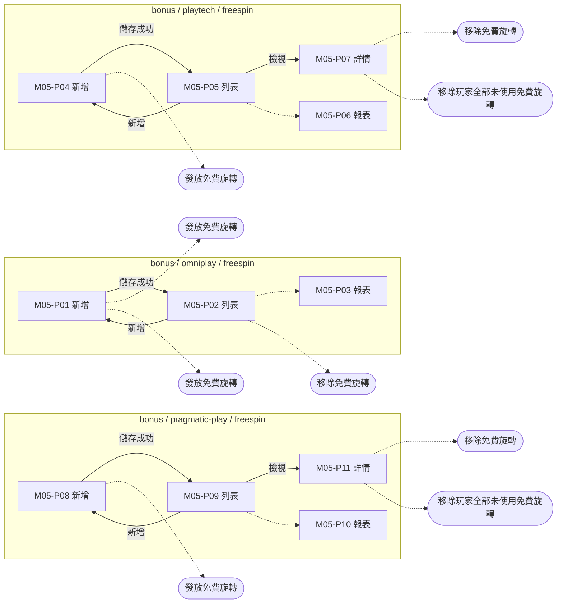
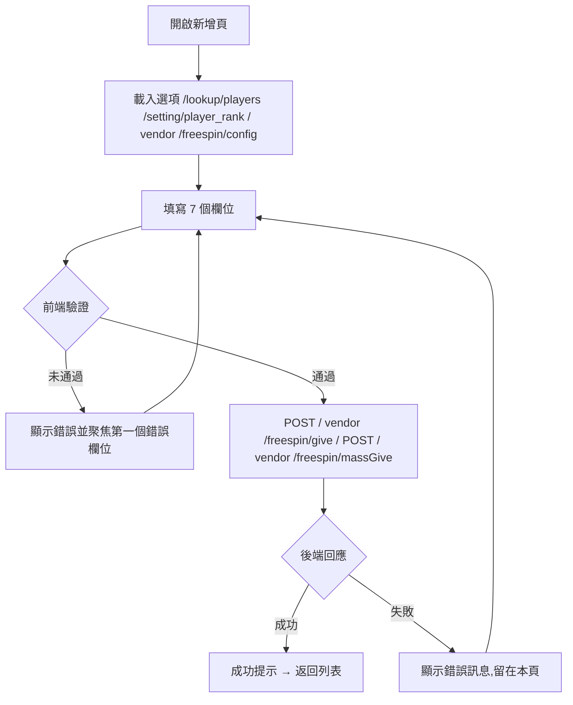
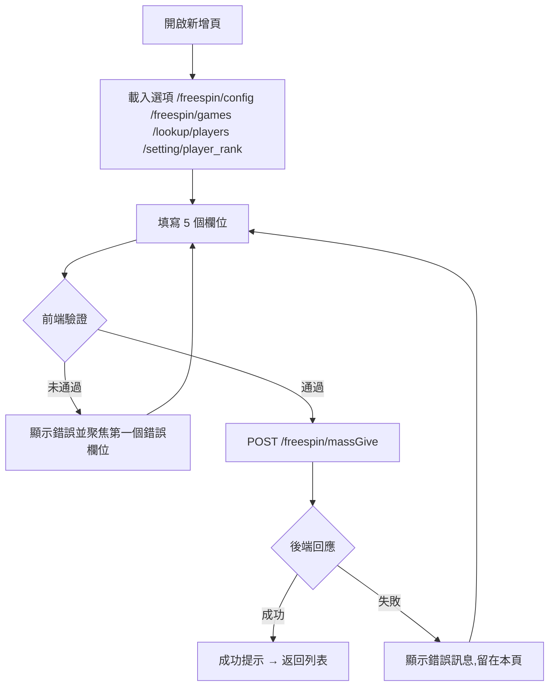
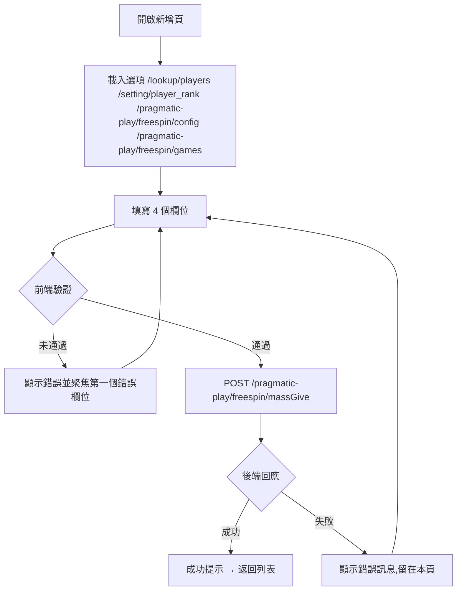

# M05 獎金(免費旋轉)(Bonus / Free Spin)— 模塊內容與操作流程(產品)

> 資料來源:後台前端程式(版本 2.8.2)靜態分析,2026-10-05。尚未經登入後實際畫面查驗的內容,狀態標為「待實機查驗」。

## 模塊說明

向指定玩家或玩家等級發放遊戲供應商的免費旋轉(Playtech、Pragmatic Play、Omniplay),查詢發放紀錄、移除未使用的免費旋轉,以及查看使用報表。

## 頁面一覽

| 頁面 | 名稱 | 類型 | 路由 | 主要操作 |
|---|---|---|---|---|
| M05-P01 | bonus / omniplay / freespin | 新增 | `/bonus/omniplay/freespin/create` | Cancel、Save |
| M05-P02 | bonus / omniplay / freespin | 列表 | `/bonus/omniplay/freespin/list` | Clear、Download CSV、Search、Cancel |
| M05-P03 | bonus / omniplay / freespin | 報表 | `/bonus/omniplay/freespin/reports` | Clear、Download CSV、Search |
| M05-P04 | bonus / playtech / freespin | 新增 | `/bonus/playtech/freespin/create` | Cancel、Save |
| M05-P05 | bonus / playtech / freespin | 列表 | `/bonus/playtech/freespin/list` | Clear、Download CSV、Search、View |
| M05-P06 | bonus / playtech / freespin | 報表 | `/bonus/playtech/freespin/reports` | Clear、Download CSV、Search |
| M05-P07 | bonus / playtech / freespin | 詳情 | `/bonus/playtech/freespin/view/:id` |  |
| M05-P08 | bonus / pragmatic-play / freespin | 新增 | `/bonus/pragmatic-play/freespin/create` | Cancel、Save |
| M05-P09 | bonus / pragmatic-play / freespin | 列表 | `/bonus/pragmatic-play/freespin/list` | Clear、Download CSV、Search、View |
| M05-P10 | bonus / pragmatic-play / freespin | 報表 | `/bonus/pragmatic-play/freespin/reports` | Clear、Download CSV、Search |
| M05-P11 | bonus / pragmatic-play / freespin | 詳情 | `/bonus/pragmatic-play/freespin/view/:id` |  |

## 頁面流程圖

## 頁面內容與操作說明

### M05-P01 bonus / omniplay / freespin(新增)

- 路由:`/bonus/omniplay/freespin/create`  權限:`create:bonus-omniplay-freespin`
- 功能點:M05-F01 新增、M05-F02 發放免費旋轉
- 表單欄位:Member ID(s)、Player Tier、Game ID(s)、Denom、Max Win Amount、Free Spin Count、Expiration Time(欄位規則見 03 開發欄位控制)
- 系統提示:「Free spin card given successfully.」、「Free spin queued for {total_players} player(s) across {total_batches} batch(es)」
- 實機狀態:待實機查驗

**操作步驟**

1. 開啟新增頁,系統載入下拉選項(/lookup/players、/setting/player_rank、/{vendor}/freespin/config)
2. 依序填寫欄位(必填欄位標示 *)
3. 按「Save」送出;前端驗證未通過時,游標跳到第一個錯誤欄位並顯示錯誤訊息
4. 驗證通過後送出 POST /{vendor}/freespin/give、POST /{vendor}/freespin/massGive
5. 成功:顯示成功提示並返回列表;失敗:顯示後端回傳的錯誤訊息,留在本頁
6. 按「Cancel」放棄並返回上一頁

### M05-P02 bonus / omniplay / freespin(列表)

- 路由:`/bonus/omniplay/freespin/list`  權限:`view:bonus-omniplay-freespin`
- 功能點:M05-F03 查詢列表、M05-F04 分頁、M05-F05 匯出、M05-F06 移除免費旋轉
- 表格欄位:Batch ID、Member ID、Free Card ID、Game Code、Game Name、Denom、Max Win Amount、Free Spin Count、Amount、Usage Status、Expiration Time、Status、Created By、Created Date、Actions
- 篩選條件:Member ID、Batch ID、Free Card ID、Status、Usage Status、Created Start Date ~ Created End Date、Items per page(欄位規則見 03 開發欄位控制)
- 系統提示:「Download started」、「Download failed, please try again」、「Free spin cancelled successfully」、「Only issued free spins can be cancelled」
- 實機狀態:待實機查驗

**操作步驟**

1. 從側欄選單進入本頁,系統載入第一頁資料(/{vendor}/freespin/list)
2. 輸入篩選條件後按「Search」查詢;按「Clear」清除條件
3. 按「Download CSV / Download」匯出目前查詢結果
4. 移除免費旋轉(POST /{vendor}/freespin/remove)

### M05-P03 bonus / omniplay / freespin(報表)

- 路由:`/bonus/omniplay/freespin/reports`  權限:`view:bonus-omniplay-freespin-reports`
- 功能點:M05-F07 查詢列表、M05-F08 分頁、M05-F09 匯出
- 篩選條件:Free Spin Report - Omniplay、Member ID、Items per page(欄位規則見 03 開發欄位控制)
- 系統提示:「Download started」、「Download failed, please try again」
- 實機狀態:待實機查驗

**操作步驟**

1. 從側欄選單進入本頁,系統載入第一頁資料(/{vendor}/freespin/report/overview、/{vendor}/freespin/report/game-records、/{vendor}/freespin/report/bonus-transaction)
2. 輸入篩選條件後按「Search」查詢;按「Clear」清除條件
3. 按「Download CSV / Download」匯出目前查詢結果

### M05-P04 bonus / playtech / freespin(新增)

- 路由:`/bonus/playtech/freespin/create`  權限:`create:playtech-freespin`
- 功能點:M05-F10 新增、M05-F11 發放免費旋轉
- 表單欄位:Member ID(s)、Player Tier、Bonus ID、Free Spin Count、Game(欄位規則見 03 開發欄位控制)
- 系統提示:「Free spin queued for {total_players} player(s) across {total_batches} batch(es)」
- 實機狀態:待實機查驗

**操作步驟**

1. 開啟新增頁,系統載入下拉選項(/freespin/config、/freespin/games、/lookup/players、/setting/player_rank)
2. 依序填寫欄位(必填欄位標示 *)
3. 按「Save」送出;前端驗證未通過時,游標跳到第一個錯誤欄位並顯示錯誤訊息
4. 驗證通過後送出 POST /freespin/massGive
5. 成功:顯示成功提示並返回列表;失敗:顯示後端回傳的錯誤訊息,留在本頁
6. 按「Cancel」放棄並返回上一頁

### M05-P05 bonus / playtech / freespin(列表)

- 路由:`/bonus/playtech/freespin/list`  權限:`view:playtech-freespin`
- 功能點:M05-F12 查詢列表、M05-F13 分頁、M05-F14 匯出
- 表格欄位:Ref ID、Member ID、Bonus ID、Free Spin Count、Free Spin Used、Status、Created By、Created Date、Actions
- 篩選條件:Member ID、Ref ID、Status、Created Start Date ~ Created End Date、Items per page(欄位規則見 03 開發欄位控制)
- 系統提示:「Download started」、「Download failed, please try again」
- 實機狀態:待實機查驗

**操作步驟**

1. 從側欄選單進入本頁,系統載入第一頁資料(/freespin/list)
2. 輸入篩選條件後按「Search」查詢;按「Clear」清除條件
3. 按「Download CSV / Download」匯出目前查詢結果

### M05-P06 bonus / playtech / freespin(報表)

- 路由:`/bonus/playtech/freespin/reports`  權限:`view:playtech-freespin`
- 功能點:M05-F15 查詢列表、M05-F16 分頁、M05-F17 匯出
- 篩選條件:Free Spin Report - Playtech、Member ID、Items per page(欄位規則見 03 開發欄位控制)
- 系統提示:「Download started」、「Download failed, please try again」
- 實機狀態:待實機查驗

**操作步驟**

1. 從側欄選單進入本頁,系統載入第一頁資料(/freespin/report/overview、/freespin/report/game-records、/freespin/report/bonus-transaction)
2. 輸入篩選條件後按「Search」查詢;按「Clear」清除條件
3. 按「Download CSV / Download」匯出目前查詢結果

### M05-P07 bonus / playtech / freespin(詳情)

- 路由:`/bonus/playtech/freespin/view/:id`  權限:`view:playtech-freespin`
- 功能點:M05-F18 檢視詳情、M05-F19 移除免費旋轉、M05-F20 移除玩家全部未使用免費旋轉
- 系統提示:「This free spin cannot be revoked because one or more spins have already been used.」、「Free spin revoked successfully」、「All free spins revoked successfully」
- 實機狀態:待實機查驗

**操作步驟**

1. 由列表按「View」進入,系統載入單筆資料(/freespin/player-detail/:id)
2. 移除免費旋轉(POST /freespin/remove)
3. 移除玩家全部未使用免費旋轉(POST /freespin/remove-all)

### M05-P08 bonus / pragmatic-play / freespin(新增)

- 路由:`/bonus/pragmatic-play/freespin/create`  權限:`create:bonus-pragmatic-freespin`
- 功能點:M05-F21 新增、M05-F22 發放免費旋轉
- 表單欄位:Member ID(s)、Player Tier、Bonus ID、Free Spin Count(欄位規則見 03 開發欄位控制)
- 系統提示:「Free spin queued for {total_players} player(s) across {total_batches} batch(es)」
- 實機狀態:待實機查驗

**操作步驟**

1. 開啟新增頁,系統載入下拉選項(/lookup/players、/setting/player_rank、/pragmatic-play/freespin/config、/pragmatic-play/freespin/games)
2. 依序填寫欄位(必填欄位標示 *)
3. 按「Save」送出;前端驗證未通過時,游標跳到第一個錯誤欄位並顯示錯誤訊息
4. 驗證通過後送出 POST /pragmatic-play/freespin/massGive
5. 成功:顯示成功提示並返回列表;失敗:顯示後端回傳的錯誤訊息,留在本頁
6. 按「Cancel」放棄並返回上一頁

### M05-P09 bonus / pragmatic-play / freespin(列表)

- 路由:`/bonus/pragmatic-play/freespin/list`  權限:`view:bonus-pragmatic-freespin`
- 功能點:M05-F23 查詢列表、M05-F24 分頁、M05-F25 匯出
- 表格欄位:Ref ID、Member ID、Bonus ID、Free Spin Count、Free Spin Used、Status、Created By、Created Date、Actions
- 篩選條件:Member ID、Ref ID、Status、Created Start Date ~ Created End Date、Items per page(欄位規則見 03 開發欄位控制)
- 系統提示:「Download started」、「Download failed, please try again」
- 實機狀態:待實機查驗

**操作步驟**

1. 從側欄選單進入本頁,系統載入第一頁資料(/pragmatic-play/freespin/list)
2. 輸入篩選條件後按「Search」查詢;按「Clear」清除條件
3. 按「Download CSV / Download」匯出目前查詢結果

### M05-P10 bonus / pragmatic-play / freespin(報表)

- 路由:`/bonus/pragmatic-play/freespin/reports`  權限:`view:pragmatic-freespin-reports`
- 功能點:M05-F26 查詢列表、M05-F27 分頁、M05-F28 匯出
- 篩選條件:Free Spin Report - Pragmatic Play、Member ID、Items per page(欄位規則見 03 開發欄位控制)
- 系統提示:「Download started」、「Download failed, please try again」
- 實機狀態:待實機查驗

**操作步驟**

1. 從側欄選單進入本頁,系統載入第一頁資料(/pragmatic-play/freespin/report/overview、/pragmatic-play/freespin/report/game-records、/pragmatic-play/freespin/report/bonus-transaction)
2. 輸入篩選條件後按「Search」查詢;按「Clear」清除條件
3. 按「Download CSV / Download」匯出目前查詢結果

### M05-P11 bonus / pragmatic-play / freespin(詳情)

- 路由:`/bonus/pragmatic-play/freespin/view/:id`  權限:`view:bonus-pragmatic-freespin`
- 功能點:M05-F29 檢視詳情、M05-F30 移除免費旋轉、M05-F31 移除玩家全部未使用免費旋轉
- 系統提示:「This free spin cannot be revoked because one or more spins have already been used.」、「Free spin revoked successfully」、「All free spins revoked successfully」
- 實機狀態:待實機查驗

**操作步驟**

1. 由列表按「View」進入,系統載入單筆資料(/pragmatic-play/freespin/player-detail/:id)
2. 移除免費旋轉(POST /pragmatic-play/freespin/remove)
3. 移除玩家全部未使用免費旋轉(POST /pragmatic-play/freespin/remove-all)

