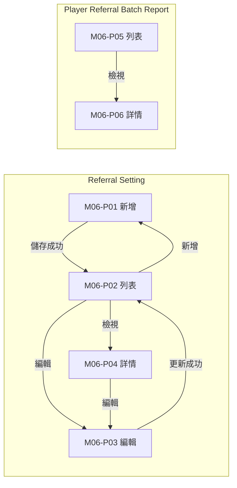
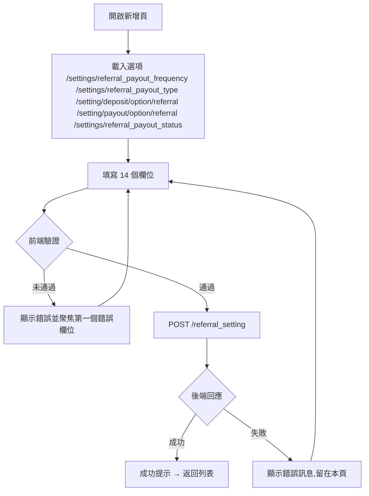
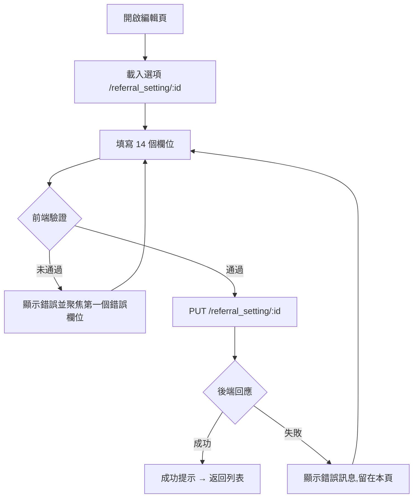

# M06 推薦獎勵(Referral)— 模塊內容與操作流程(產品)

> 資料來源:後台前端程式(版本 2.8.2)靜態分析,2026-10-05。尚未經登入後實際畫面查驗的內容,狀態標為「待實機查驗」。

## 模塊說明

設定推薦活動規則(期間、派彩頻率與方式、獎金池與上限、流水門檻),並查詢推薦報表。

## 頁面一覽

| 頁面 | 名稱 | 類型 | 路由 | 主要操作 |
|---|---|---|---|---|
| M06-P01 | referral-setting | 新增 | `/referral-setting/add` | Cancel、Save |
| M06-P02 | Referral Setting | 列表 | `/referral-setting/list` | Clear、Search、View、Edit、Deactivate |
| M06-P03 | Title | 編輯 | `/referral-setting/update/:id` | Cancel、Save |
| M06-P04 | Title | 詳情 | `/referral-setting/view/:id` | Edit |
| M06-P05 | Player Referral Batch Report | 列表 | `/reports/referral-report/list` | Clear、Download、Search、View |
| M06-P06 | referral-report | 詳情 | `/reports/referral-report/view/:id` | Download |

## 頁面流程圖

## 頁面內容與操作說明

### M06-P01 referral-setting(新增)

- 路由:`/referral-setting/add`  權限:`create:referral-setting`
- 功能點:M06-F01 新增
- 表單欄位:Title *、Payout/Earning Frequency *、Status *、Period From *、Period To *、Payout Type *、Payout Percentage / Payout Amount、Max Cap Amount *、Pool Amount *、Min Turnover *、Payout Option *、Deposit Option *、Minimum Deposit Amount *、Terms and Conditions *(欄位規則見 03 開發欄位控制)
- 系統提示:「Referral Setting created successfully」、「Error creating referral setting」
- 實機狀態:待實機查驗

**操作步驟**

1. 開啟新增頁,系統載入下拉選項(/settings/referral_payout_frequency、/settings/referral_payout_type、/setting/deposit/option/referral、/setting/payout/option/referral、/settings/referral_payout_status)
2. 依序填寫欄位(必填欄位標示 *)
3. 按「Save」送出;前端驗證未通過時,游標跳到第一個錯誤欄位並顯示錯誤訊息
4. 驗證通過後送出 POST /referral_setting
5. 成功:顯示成功提示並返回列表;失敗:顯示後端回傳的錯誤訊息,留在本頁
6. 按「Cancel」放棄並返回上一頁

### M06-P02 Referral Setting(列表)

- 路由:`/referral-setting/list`  權限:`view:referral-setting`
- 功能點:M06-F02 查詢列表、M06-F03 欄位排序、M06-F04 分頁
- 表格欄位:ID、Title、Frequency、Period From、Period To、Status、Actions
- 篩選條件:Title、Status、Start Date (FROM) ~ Start Date (TO)、Items per page(欄位規則見 03 開發欄位控制)
- 系統提示:「Referral setting deactivated successfully」
- 實機狀態:待實機查驗

**操作步驟**

1. 從側欄選單進入本頁,系統載入第一頁資料(/referral_setting)
2. 輸入篩選條件後按「Search」查詢;按「Clear」清除條件
3. 點欄位標題排序

### M06-P03 Title(編輯)

- 路由:`/referral-setting/update/:id`  權限:`edit:referral-setting`
- 功能點:M06-F05 編輯
- 表單欄位:Title、Status、Period From、Period To、Payout Frequency、Payout Frequency、Payout Type、Payout Option、Deposit Option、Min Deposit Amount、Max Cap Amount、Min Turnover Amount、Pool Amount、Terms and Conditions(欄位規則見 03 開發欄位控制)
- ⚠ **實際可修改的欄位**:Status;其餘 13 個欄位只顯示、不會送出(Title、Period From、Period To、Payout Frequency、Payout Frequency、Payout Type、Payout Option、Deposit Option、Min Deposit Amount、Max Cap Amount、Min Turnover Amount、Pool Amount、Terms and Conditions)
- 系統提示:「Referral Setting not found」、「Error updating referral setting」
- 實機狀態:待實機查驗

**操作步驟**

1. 開啟編輯頁,系統載入下拉選項(/referral_setting/:id)
2. 依序填寫欄位(必填欄位標示 *)
3. 按「Save」送出;前端驗證未通過時,游標跳到第一個錯誤欄位並顯示錯誤訊息
4. 驗證通過後送出 PUT /referral_setting/:id
5. 成功:顯示成功提示並返回列表;失敗:顯示後端回傳的錯誤訊息,留在本頁
6. 按「Cancel」放棄並返回上一頁

### M06-P04 Title(詳情)

- 路由:`/referral-setting/view/:id`  權限:`view:referral-setting`
- 功能點:M06-F06 檢視詳情
- 系統提示:「Referral Setting not found」
- 實機狀態:待實機查驗

**操作步驟**

1. 由列表按「View」進入,系統載入單筆資料(/referral_setting/:id)
2. 按「Edit」進入編輯頁

### M06-P05 Player Referral Batch Report(列表)

- 路由:`/reports/referral-report/list`  權限:`view:referral-report`
- 功能點:M06-F07 查詢列表、M06-F08 欄位排序、M06-F09 分頁、M06-F10 匯出
- 表格欄位:ID、Title、Date、Frequency、Option、Pool Amount、Total Payout、Status、Actions
- 篩選條件:Title、Date From ~ Date To、Items per page(欄位規則見 03 開發欄位控制)
- 系統提示:「No data available to download. Please search for data first.」、「Referral report downloaded successfully」、「Failed to download referral report. Please try again.」、「No data found」
- 實機狀態:待實機查驗

**操作步驟**

1. 從側欄選單進入本頁,系統載入第一頁資料(/referral_report)
2. 輸入篩選條件後按「Search」查詢;按「Clear」清除條件
3. 點欄位標題排序
4. 按「Download CSV / Download」匯出目前查詢結果

### M06-P06 referral-report(詳情)

- 路由:`/reports/referral-report/view/:id`  權限:`view:referral-report`
- 功能點:M06-F11 檢視詳情
- 表格欄位:Referral、Referee、Transaction Date、Deposit Amount、Turnover Amount、Payout Amount、Status
- 表單欄位:Items per page(欄位規則見 03 開發欄位控制)
- 系統提示:「Failed to download referral report. Please try again.」、「Referral report downloaded successfully」、「No transaction details found for this report」
- 實機狀態:待實機查驗

**操作步驟**

1. 由列表按「View」進入,系統載入單筆資料(/referral_report/:id)

