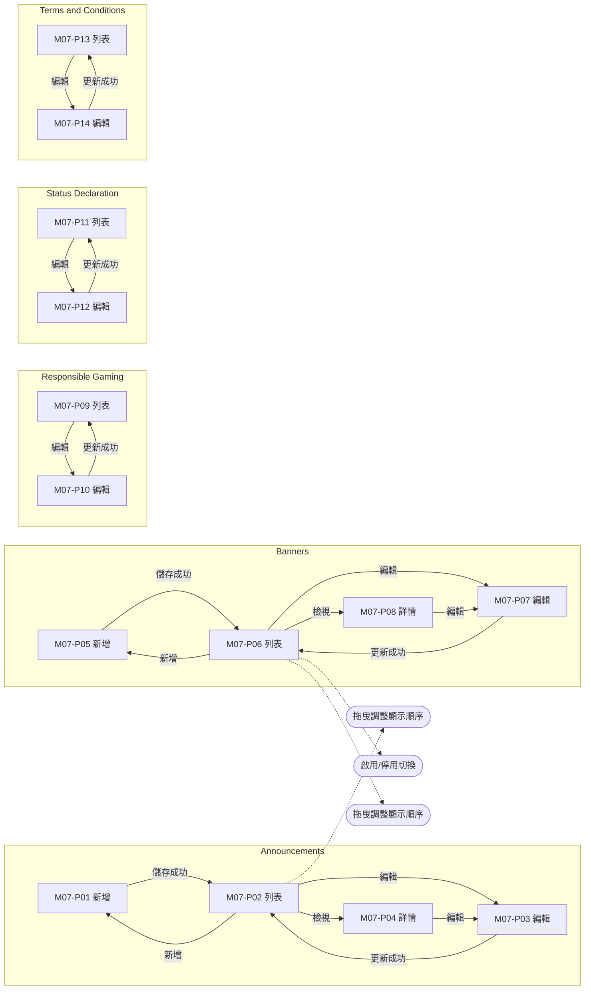
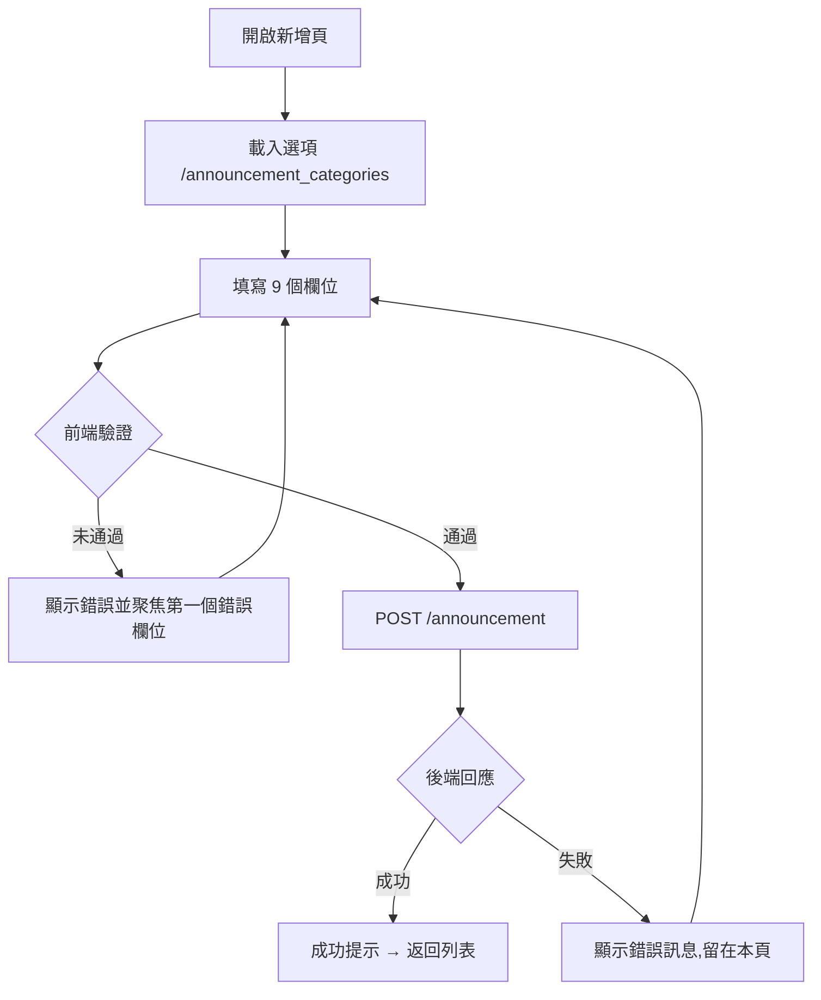
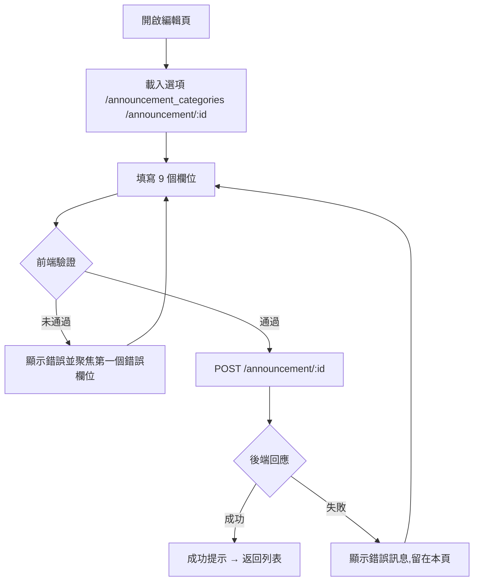
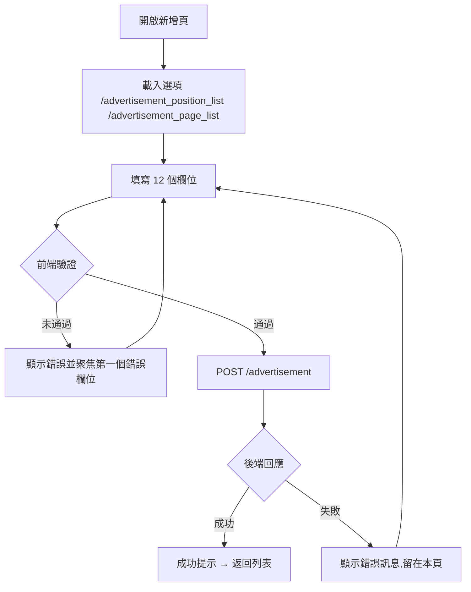
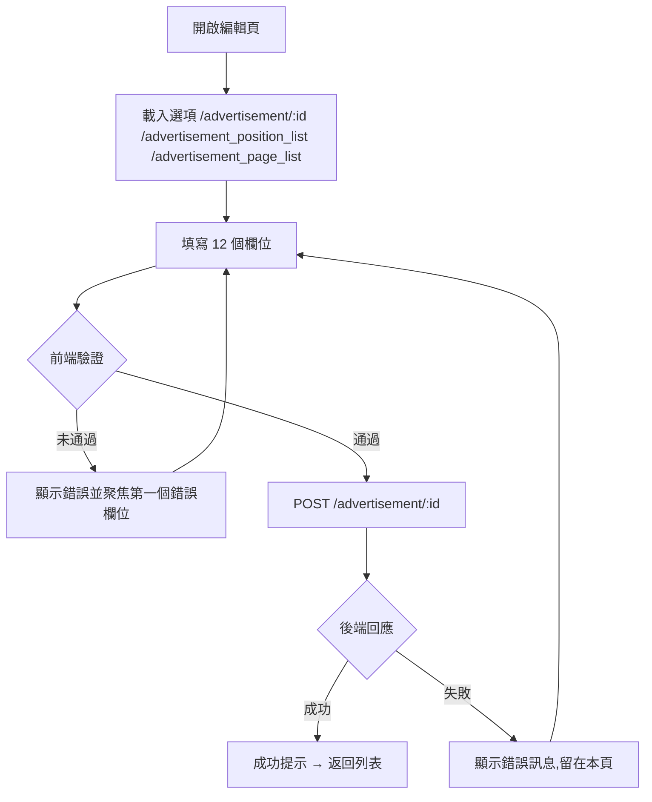
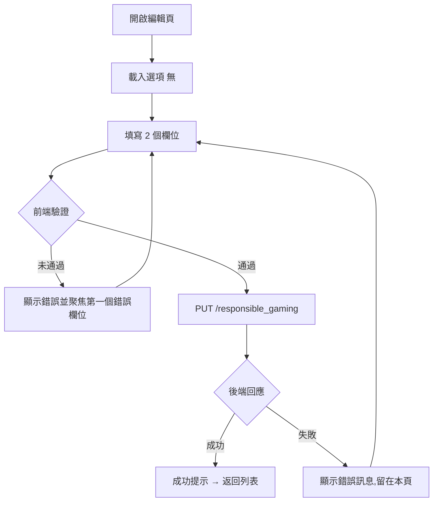
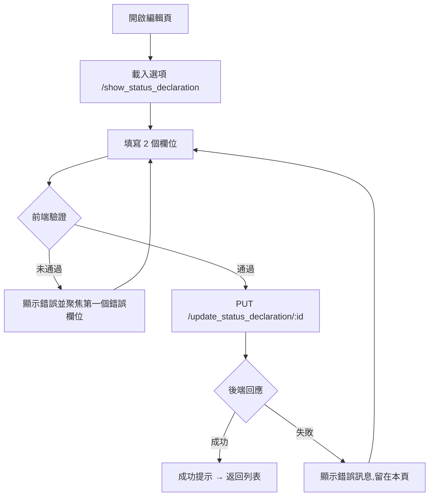

# M07 內容中心(Contents Hub)— 模塊內容與操作流程(產品)

> 資料來源:後台前端程式(版本 2.8.2)靜態分析,2026-10-05。尚未經登入後實際畫面查驗的內容,狀態標為「待實機查驗」。

## 模塊說明

管理前台顯示內容:Banner 廣告、公告、條款與細則、責任博彩說明、狀態聲明(多語系內容)。

## 頁面一覽

| 頁面 | 名稱 | 類型 | 路由 | 主要操作 |
|---|---|---|---|---|
| M07-P01 | announcements | 新增 | `/announcements/add` | Cancel、Save、Upload |
| M07-P02 | Announcements | 列表 | `/announcements/list` | Clear、Search、View、Edit |
| M07-P03 | announcements | 編輯 | `/announcements/update/:id` | Cancel、Save、Upload |
| M07-P04 | Announcements | 詳情 | `/announcements/view/:id` | Edit、View、Close |
| M07-P05 | banners | 新增 | `/banners/add` | Cancel、Save |
| M07-P06 | Banners | 列表 | `/banners/list` | Clear、Search、View、Edit |
| M07-P07 | banners | 編輯 | `/banners/update/:id` | Cancel、Update |
| M07-P08 | banners | 詳情 | `/banners/view/:id` | Edit |
| M07-P09 | Responsible Gaming | 列表 | `/responsible-gaming/list` | Edit |
| M07-P10 | Title | 編輯 | `/responsible-gaming/update/:id` | Cancel、Update |
| M07-P11 | Status Declaration | 列表 | `/status-declaration/list` | Edit |
| M07-P12 | status-declaration | 編輯 | `/status-declaration/update/:id` | Cancel、Update |
| M07-P13 | Terms and Conditions | 列表 | `/terms-and-conditions/list` | Edit |
| M07-P14 | Title | 編輯 | `/terms-and-conditions/update/:id` | Cancel、Update |

## 頁面流程圖

## 頁面內容與操作說明

### M07-P01 announcements(新增)

- 路由:`/announcements/add`  權限:`create:announcements`
- 功能點:M07-F01 新增
- 表單欄位:Name、Category、Status、Enable Popup、Media Type、Video Link、Banner Image、Start Date ~ End Date、Content(欄位規則見 03 開發欄位控制)
- 系統提示:「Announcement created successfully」
- 實機狀態:待實機查驗

**操作步驟**

1. 開啟新增頁,系統載入下拉選項(/announcement_categories)
2. 依序填寫欄位(必填欄位標示 *)
3. 按「Save」送出;前端驗證未通過時,游標跳到第一個錯誤欄位並顯示錯誤訊息
4. 驗證通過後送出 POST /announcement
5. 成功:顯示成功提示並返回列表;失敗:顯示後端回傳的錯誤訊息,留在本頁
6. 按「Cancel」放棄並返回上一頁

### M07-P02 Announcements(列表)

- 路由:`/announcements/list`  權限:`view:announcements`
- 功能點:M07-F02 查詢列表、M07-F03 欄位排序、M07-F04 分頁、M07-F05 拖曳調整顯示順序
- 表格欄位:Name、Category、Enable Popup、Status、Sequence、Start Date、End Date、Created At、Actions
- 篩選條件:Name、Category、Status、Popup、Start Date (FROM) ~ Start Date (TO)、Items per page(欄位規則見 03 開發欄位控制)
- 系統提示:「Announcement sequence updated successfully」、「Drag and drop is disabled when sorting」、「Drag and drop is disabled for inactive announcements」、「Drag and drop enabled when filtered by Status only」
- 實機狀態:待實機查驗

**操作步驟**

1. 從側欄選單進入本頁,系統載入第一頁資料(/announcement_categories、/announcement)
2. 輸入篩選條件後按「Search」查詢;按「Clear」清除條件
3. 點欄位標題排序
4. 拖曳調整顯示順序(POST /announcement/sequence/update)

### M07-P03 announcements(編輯)

- 路由:`/announcements/update/:id`  權限:`edit:announcements`
- 功能點:M07-F06 編輯
- 表單欄位:Name、Category、Status、Enable Popup、Start Date ~ End Date、Media Type、Video Link、Banner Image、Content(欄位規則見 03 開發欄位控制)
- 系統提示:「Announcement not found」、「Announcement updated successfully」
- 實機狀態:待實機查驗

**操作步驟**

1. 開啟編輯頁,系統載入下拉選項(/announcement_categories、/announcement/:id)
2. 依序填寫欄位(必填欄位標示 *)
3. 按「Save」送出;前端驗證未通過時,游標跳到第一個錯誤欄位並顯示錯誤訊息
4. 驗證通過後送出 POST /announcement/:id
5. 成功:顯示成功提示並返回列表;失敗:顯示後端回傳的錯誤訊息,留在本頁
6. 按「Cancel」放棄並返回上一頁

### M07-P04 Announcements(詳情)

- 路由:`/announcements/view/:id`  權限:`view:announcements`
- 功能點:M07-F07 檢視詳情
- 系統提示:「Announcement not found」
- 實機狀態:待實機查驗

**操作步驟**

1. 由列表按「View」進入,系統載入單筆資料(/announcement/:id)
2. 按「Edit」進入編輯頁

### M07-P05 banners(新增)

- 路由:`/banners/add`  權限:`create:banners`
- 功能點:M07-F08 新增
- 表單欄位:Name、Position、Page、Status、Start Date ~ End Date、Media Type、Video Link (Large)、Video Link (Medium)、Video Link (Small)、Desktop(1368x360)、Tablet(768x360)、Mobile(500x500)(欄位規則見 03 開發欄位控制)
- 系統提示:「Banner created successfully」、「Error creating banner」
- 實機狀態:待實機查驗

**操作步驟**

1. 開啟新增頁,系統載入下拉選項(/advertisement_position_list、/advertisement_page_list)
2. 依序填寫欄位(必填欄位標示 *)
3. 按「Save」送出;前端驗證未通過時,游標跳到第一個錯誤欄位並顯示錯誤訊息
4. 驗證通過後送出 POST /advertisement
5. 成功:顯示成功提示並返回列表;失敗:顯示後端回傳的錯誤訊息,留在本頁
6. 按「Cancel」放棄並返回上一頁

### M07-P06 Banners(列表)

- 路由:`/banners/list`  權限:`view:banners`
- 功能點:M07-F09 查詢列表、M07-F10 欄位排序、M07-F11 分頁、M07-F12 啟用/停用切換、M07-F13 拖曳調整顯示順序
- 表格欄位:Name、Position、Page、Sequence、Start Date、End Date、Status、Created At、Updated At、Actions
- 篩選條件:Name、Page、Status、Start Date (FROM) ~ Start Date (TO)、Items per page(欄位規則見 03 開發欄位控制)
- 系統提示:「Banner sequence updated successfully」、「Banner status changed successfully」、「Drag and drop is disabled when sorting」、「Drag and drop is disabled for inactive banners」、「Drag and drop is enabled after filtering by Page」
- 實機狀態:待實機查驗

**操作步驟**

1. 從側欄選單進入本頁,系統載入第一頁資料(/advertisement、/advertisement_page_list)
2. 輸入篩選條件後按「Search」查詢;按「Clear」清除條件
3. 點欄位標題排序
4. 啟用/停用切換(PUT /advertisement/status/:id)
5. 拖曳調整顯示順序(POST /advertisement/sequence/update)

### M07-P07 banners(編輯)

- 路由:`/banners/update/:id`  權限:`edit:banners`
- 功能點:M07-F14 編輯
- 表單欄位:Name、Position、Page、Status、Start Date ~ End Date、Media Type、Video Link (Large)、Video Link (Medium)、Video Link (Small)、Desktop(1368x360)、Tablet(768x360)、Mobile(500x500)(欄位規則見 03 開發欄位控制)
- 系統提示:「Banner not found」、「Banner updated successfully」、「Error updating banner」
- 實機狀態:待實機查驗

**操作步驟**

1. 開啟編輯頁,系統載入下拉選項(/advertisement/:id、/advertisement_position_list、/advertisement_page_list)
2. 依序填寫欄位(必填欄位標示 *)
3. 按「Update」送出;前端驗證未通過時,游標跳到第一個錯誤欄位並顯示錯誤訊息
4. 驗證通過後送出 POST /advertisement/:id
5. 成功:顯示成功提示並返回列表;失敗:顯示後端回傳的錯誤訊息,留在本頁
6. 按「Cancel」放棄並返回上一頁

### M07-P08 banners(詳情)

- 路由:`/banners/view/:id`  權限:`view:banners`
- 功能點:M07-F15 檢視詳情
- 系統提示:「Banner not found」
- 實機狀態:待實機查驗

**操作步驟**

1. 由列表按「View」進入,系統載入單筆資料(/advertisement/:id)
2. 按「Edit」進入編輯頁

### M07-P09 Responsible Gaming(列表)

- 路由:`/responsible-gaming/list`  權限:`view:responsible-gaming`
- 功能點:M07-F16 查詢列表
- 篩選條件:Language(欄位規則見 03 開發欄位控制)
- 系統提示:「responsible gaming not found」
- 實機狀態:待實機查驗

**操作步驟**

1. 從側欄選單進入本頁,系統載入第一頁資料(/get_language)
2. 輸入篩選條件後按「Search」查詢;按「Clear」清除條件

### M07-P10 Title(編輯)

- 路由:`/responsible-gaming/update/:id`  權限:`edit:responsible-gaming`
- 功能點:M07-F17 編輯
- 表單欄位:Title、Content(欄位規則見 03 開發欄位控制)
- 系統提示:「responsible gaming not found」、「Responsible Gaming updated successfully」、「Error updating Responsible Gaming: {error}」
- 實機狀態:待實機查驗

**操作步驟**

1. 開啟編輯頁,系統載入下拉選項
2. 依序填寫欄位(必填欄位標示 *)
3. 按「Update」送出;前端驗證未通過時,游標跳到第一個錯誤欄位並顯示錯誤訊息
4. 驗證通過後送出 PUT /responsible_gaming
5. 成功:顯示成功提示並返回列表;失敗:顯示後端回傳的錯誤訊息,留在本頁
6. 按「Cancel」放棄並返回上一頁

### M07-P11 Status Declaration(列表)

- 路由:`/status-declaration/list`  權限:`view:status-declaration`
- 功能點:M07-F18 查詢列表
- 系統提示:「Status Declaration not found」
- 實機狀態:待實機查驗

**操作步驟**

1. 從側欄選單進入本頁,系統載入第一頁資料(/show_status_declaration)

### M07-P12 status-declaration(編輯)

- 路由:`/status-declaration/update/:id`  權限:`edit:status-declaration`
- 功能點:M07-F19 編輯
- 表單欄位:Status、Content(欄位規則見 03 開發欄位控制)
- 系統提示:「Status Declaration not found」、「Status Declaration updated successfully」、「Error updating Status Declaration: {error}」
- 實機狀態:待實機查驗

**操作步驟**

1. 開啟編輯頁,系統載入下拉選項(/show_status_declaration)
2. 依序填寫欄位(必填欄位標示 *)
3. 按「Update」送出;前端驗證未通過時,游標跳到第一個錯誤欄位並顯示錯誤訊息
4. 驗證通過後送出 PUT /update_status_declaration/:id
5. 成功:顯示成功提示並返回列表;失敗:顯示後端回傳的錯誤訊息,留在本頁
6. 按「Cancel」放棄並返回上一頁

### M07-P13 Terms and Conditions(列表)

- 路由:`/terms-and-conditions/list`  權限:`view:terms-and-conditions`
- 功能點:M07-F20 查詢列表
- 篩選條件:Language(欄位規則見 03 開發欄位控制)
- 系統提示:「terms and conditions not found」
- 實機狀態:待實機查驗

**操作步驟**

1. 從側欄選單進入本頁,系統載入第一頁資料(/get_language)
2. 輸入篩選條件後按「Search」查詢;按「Clear」清除條件

### M07-P14 Title(編輯)

- 路由:`/terms-and-conditions/update/:id`  權限:`edit:terms-and-conditions`
- 功能點:M07-F21 編輯
- 表單欄位:Title、Content(欄位規則見 03 開發欄位控制)
- 系統提示:「terms and conditions not found」、「Terms and Conditions updated successfully」、「Error updating Terms and Conditions: {error}」
- 實機狀態:待實機查驗

**操作步驟**

1. 開啟編輯頁,系統載入下拉選項
2. 依序填寫欄位(必填欄位標示 *)
3. 按「Update」送出;前端驗證未通過時,游標跳到第一個錯誤欄位並顯示錯誤訊息
4. 驗證通過後送出 PUT /term_and_condition
5. 成功:顯示成功提示並返回列表;失敗:顯示後端回傳的錯誤訊息,留在本頁
6. 按「Cancel」放棄並返回上一頁

