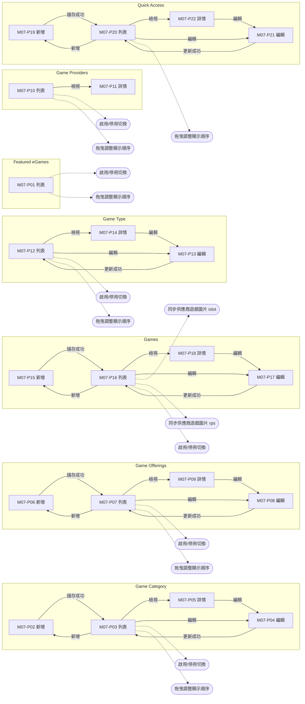
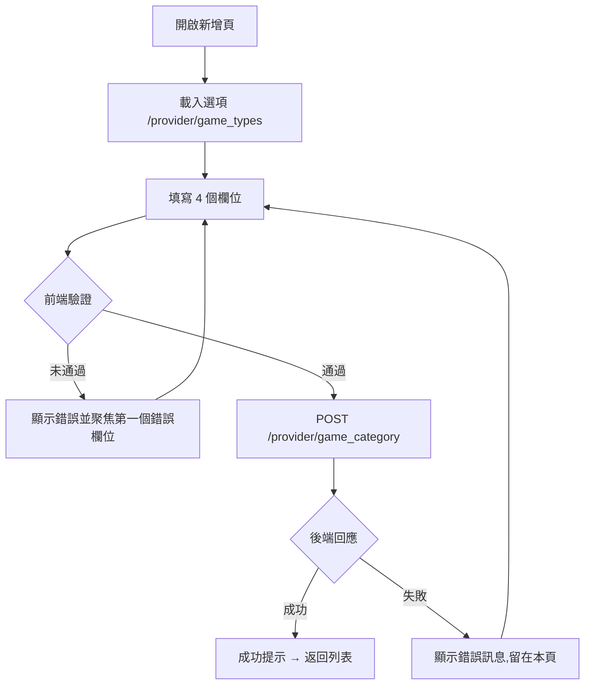
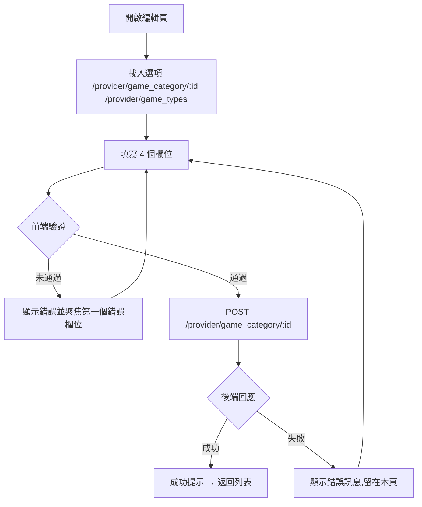
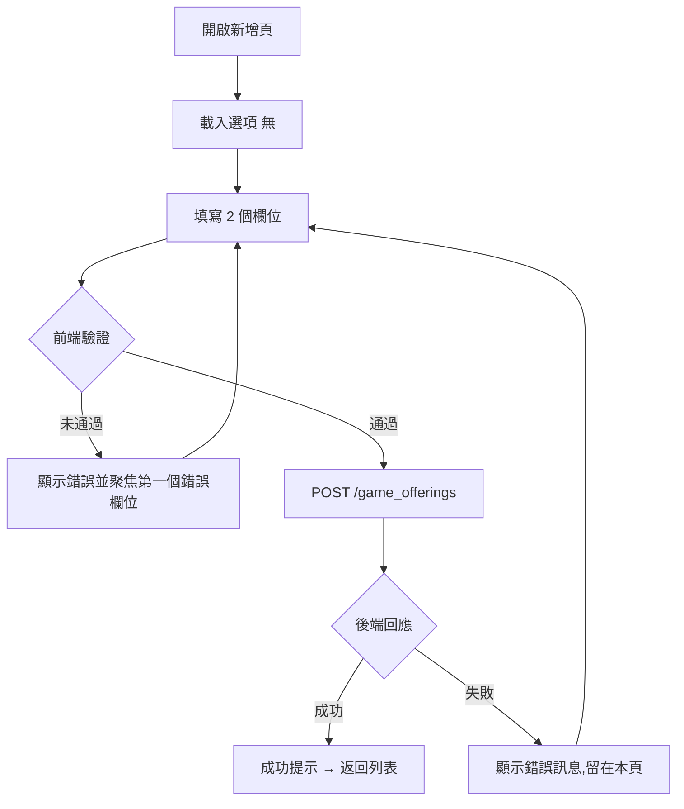
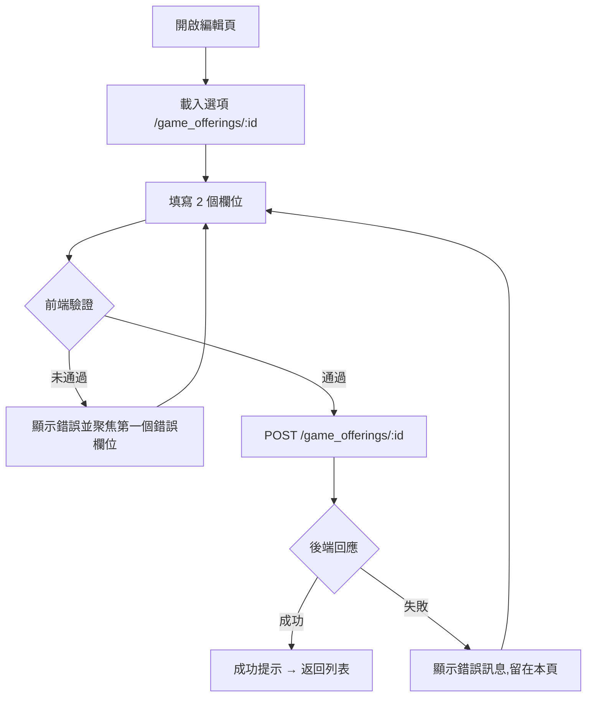
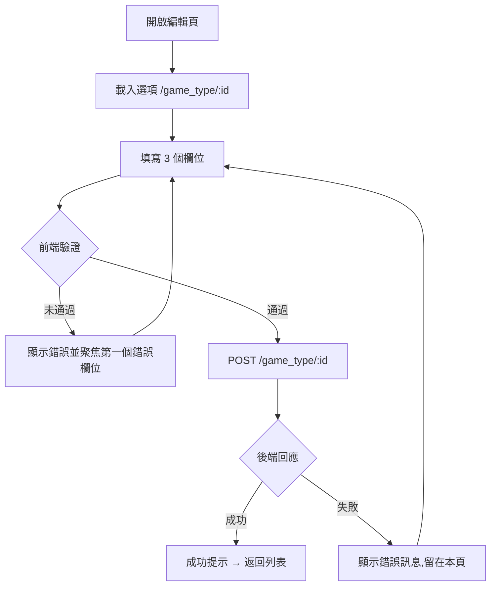
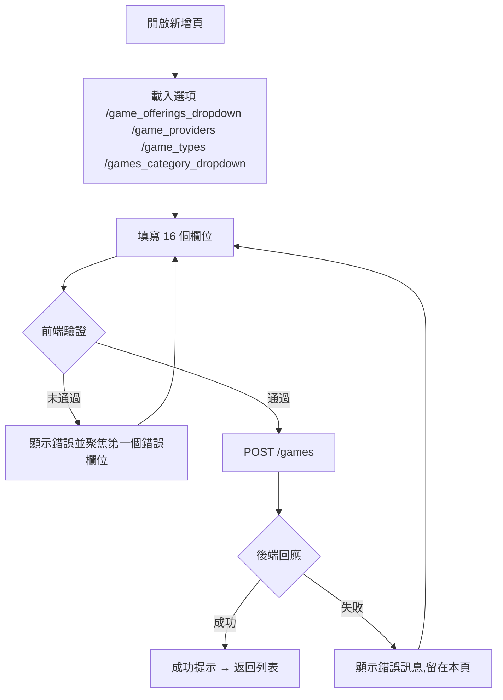
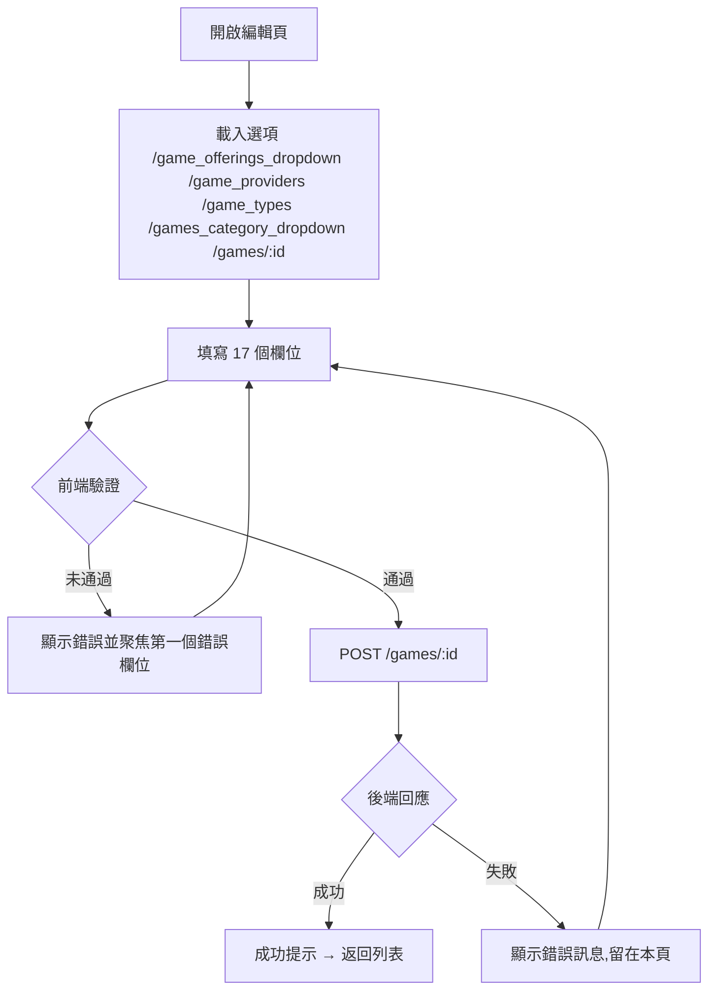
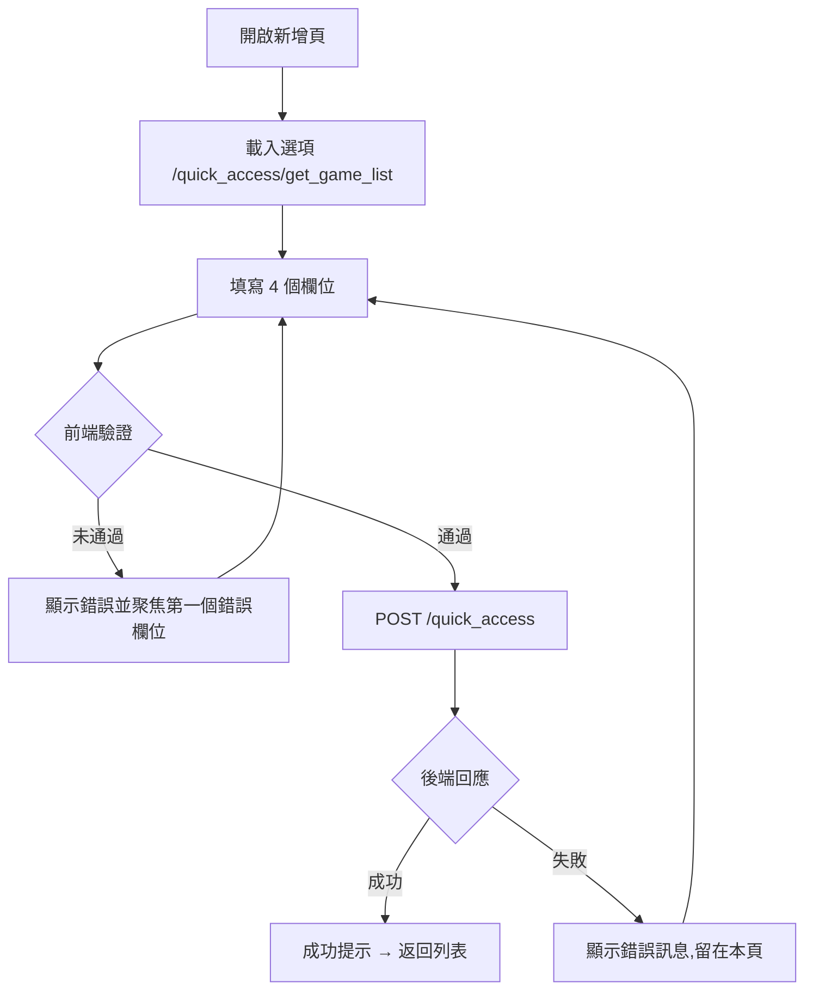
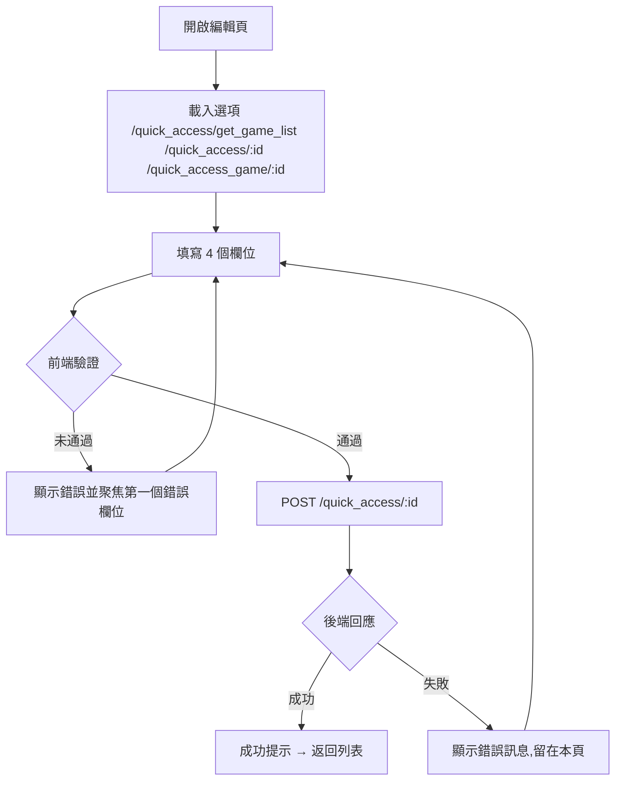

# M07 遊戲中心(Games Hub)— 模塊內容與操作流程(產品)

> 資料來源:後台前端程式(版本 2.8.2)靜態分析,並於 2026-10-05 以人工登入帳號實機只讀查驗(選單依該帳號角色)。各頁查驗結果見 04 測試報告。

## 模塊說明

管理遊戲大廳:快捷入口、遊戲、精選遊戲、遊戲分類、遊戲供應商、遊戲產品線(Game Offering)、遊戲類型。

## 頁面一覽

| 頁面 | 名稱 | 類型 | 路由 | 主要操作 |
|---|---|---|---|---|
| M07-P01 | Featured eGames | 列表 | `/featured-games/list` | Clear、Search、Cancel、Save |
| M07-P02 | game-category | 新增 | `/game-category/add` | Cancel、Save |
| M07-P03 | Game Category | 列表 | `/game-category/list` | Clear、Search、View、Edit |
| M07-P04 | game-category | 編輯 | `/game-category/update/:id` | Cancel、Update |
| M07-P05 | game-category | 詳情 | `/game-category/view/:id` | Edit |
| M07-P06 | game-offering | 新增 | `/game-offering/add` | Cancel、Save |
| M07-P07 | Game Offerings | 列表 | `/game-offering/list` | Clear、Search、View、Edit |
| M07-P08 | game-offering | 編輯 | `/game-offering/update/:id` | Cancel、Update |
| M07-P09 | game-offering | 詳情 | `/game-offering/view/:id` | Edit |
| M07-P10 | Game Providers | 列表 | `/game-provider/list` | Clear、Search |
| M07-P11 | game-provider | 詳情 | `/game-provider/view/:id` |  |
| M07-P12 | Game Type | 列表 | `/game-type/list` | Clear、Search、View、Edit |
| M07-P13 | game-type | 編輯 | `/game-type/update/:id` | Cancel、Update |
| M07-P14 | game-type | 詳情 | `/game-type/view/:id` | Edit |
| M07-P15 | games | 新增 | `/games/add` | Cancel、Save |
| M07-P16 | Games | 列表 | `/games/list` | Clear、Search、View、Edit |
| M07-P17 | games | 編輯 | `/games/update/:id` | Cancel、Update |
| M07-P18 | games | 詳情 | `/games/view/:id` | Edit |
| M07-P19 | quickAccess | 新增 | `/quickAccess/add` | Cancel、Save、Upload |
| M07-P20 | Quick Access | 列表 | `/quickAccess/list` | Clear、Search、View、Edit |
| M07-P21 | quickAccess | 編輯 | `/quickAccess/update/:id` | Cancel、Save、Upload |
| M07-P22 | Quick Access Management | 詳情 | `/quickAccess/view/:id` | Edit |

## 頁面流程圖

## 頁面內容與操作說明

### M07-P01 Featured eGames(列表)

- 路由:`/featured-games/list`  權限:`view:featured-games`
- 功能點:M07-F01 查詢列表、M07-F02 欄位排序、M07-F03 分頁、M07-F04 啟用/停用切換、M07-F05 拖曳調整顯示順序
- 表格欄位:Game Name、Status、Sequence Number、Created At、Actions
- 條件顯示的欄位:Select Games(按「Add Featured eGames」後的對話框內)
- 篩選條件:Game Name、Status、Items per page、Select Games(欄位規則見 03 開發欄位控制)
- 系統提示:「Please select at least one game」、「Featured Games added successfully」、「Featured Game removed successfully」、「Featured Game sequence updated successfully」、「Drag disabled while searching. Clear filters to reorder」
- 選單位置:✅ 選單;實機狀態:✅ 一致;截圖(本機,不進 git):`.playwright-output/live/featured-games_list.png`

**操作步驟**

1. 從側欄選單進入本頁,系統載入第一頁資料(/featured_games、/game_list_dropdown)
2. 輸入篩選條件後按「Search」查詢;按「Clear」清除條件
3. 點欄位標題排序
4. 啟用/停用切換(POST /featured_games/status/:id)
5. 拖曳調整顯示順序(POST /featured_games/sequence/update)

### M07-P02 game-category(新增)

- 路由:`/game-category/add`  權限:`create:game-category`
- 功能點:M07-F06 新增
- 表單欄位:Category Name、Game Type、Game Category Image、Status(欄位規則見 03 開發欄位控制)
- 系統提示:「Category created successfully」、「Error creating category: {error}」、「File size must be less than 5MB」、「Invalid file type. Supported formats: JPEG, PNG, JPG, GIF, SVG」
- 選單位置:由列表進入;實機狀態:✅ 一致;截圖(本機,不進 git):`.playwright-output/live/game-category_add.png`

**操作步驟**

1. 開啟新增頁,系統載入下拉選項(/provider/game_types)
2. 依序填寫欄位(必填欄位標示 *)
3. 按「Save」送出;前端驗證未通過時,游標跳到第一個錯誤欄位並顯示錯誤訊息
4. 驗證通過後送出 POST /provider/game_category
5. 成功:顯示成功提示並返回列表;失敗:顯示後端回傳的錯誤訊息,留在本頁
6. 按「Cancel」放棄並返回上一頁

### M07-P03 Game Category(列表)

- 路由:`/game-category/list`  權限:`view:game-category`
- 功能點:M07-F07 查詢列表、M07-F08 欄位排序、M07-F09 分頁、M07-F10 啟用/停用切換、M07-F11 拖曳調整顯示順序
- 表格欄位:Category Name、Sequence No.、Game Type、Created At、Updated At、Status、Actions
- 篩選條件:Game Type、Status、Items per page(欄位規則見 03 開發欄位控制)
- 系統提示:「Game category status changed successfully」、「Game Category sequence updated successfully」、「Drag disabled while searching. Clear filters to reorder」
- 選單位置:✅ 選單;實機狀態:✅ 一致;截圖(本機,不進 git):`.playwright-output/live/game-category_list.png`

**操作步驟**

1. 從側欄選單進入本頁,系統載入第一頁資料(/provider/game_category、/provider/game_types)
2. 輸入篩選條件後按「Search」查詢;按「Clear」清除條件
3. 點欄位標題排序
4. 啟用/停用切換(PUT /provider/game_category/status/:id)
5. 拖曳調整顯示順序(POST /provider/game_category/sequence/update)

### M07-P04 game-category(編輯)

- 路由:`/game-category/update/:id`  權限:`edit:game-category`
- 功能點:M07-F12 編輯
- 顯示內容(實機):ID、Created At、Updated At
- 表單欄位:Category Name、Game Type、Status、Game Category Image(欄位規則見 03 開發欄位控制)
- 系統提示:「Game category not found」、「Category updated successfully」、「Error updating category: {error}」、「File size must be less than 5MB」、「Invalid file type. Supported formats: JPEG, PNG, JPG, GIF, SVG」
- 選單位置:由列表進入;實機狀態:✅ 一致;截圖(本機,不進 git):`.playwright-output/live/game-category_update_id.png`

**操作步驟**

1. 開啟編輯頁,系統載入下拉選項(/provider/game_category/:id、/provider/game_types)
2. 依序填寫欄位(必填欄位標示 *)
3. 按「Update」送出;前端驗證未通過時,游標跳到第一個錯誤欄位並顯示錯誤訊息
4. 驗證通過後送出 POST /provider/game_category/:id
5. 成功:顯示成功提示並返回列表;失敗:顯示後端回傳的錯誤訊息,留在本頁
6. 按「Cancel」放棄並返回上一頁

### M07-P05 game-category(詳情)

- 路由:`/game-category/view/:id`  權限:`view:game-category`
- 功能點:M07-F13 檢視詳情
- 顯示內容(實機):ID、Category Name、Game Type、Status、Game Category Image、Created At、Updated At
- 系統提示:「Game category not found」
- 選單位置:由列表進入;實機狀態:✅ 一致;截圖(本機,不進 git):`.playwright-output/live/game-category_view_id.png`

**操作步驟**

1. 由列表按「View」進入,系統載入單筆資料(/provider/game_category/:id)
2. 按「Edit」進入編輯頁

### M07-P06 game-offering(新增)

- 路由:`/game-offering/add`  權限:`create:game-offering`
- 功能點:M07-F14 新增
- 表單欄位:Game Offering Name、Status(欄位規則見 03 開發欄位控制)
- 系統提示:「Game Offering created successfully」
- 選單位置:由列表進入;實機狀態:✅ 一致;截圖(本機,不進 git):`.playwright-output/live/game-offering_add.png`

**操作步驟**

1. 開啟新增頁,系統載入下拉選項
2. 依序填寫欄位(必填欄位標示 *)
3. 按「Save」送出;前端驗證未通過時,游標跳到第一個錯誤欄位並顯示錯誤訊息
4. 驗證通過後送出 POST /game_offerings
5. 成功:顯示成功提示並返回列表;失敗:顯示後端回傳的錯誤訊息,留在本頁
6. 按「Cancel」放棄並返回上一頁

### M07-P07 Game Offerings(列表)

- 路由:`/game-offering/list`  權限:`view:game-offering`
- 功能點:M07-F15 查詢列表、M07-F16 欄位排序、M07-F17 分頁、M07-F18 啟用/停用切換、M07-F19 拖曳調整顯示順序
- 表格欄位:Game Offering Name、Sequence Number、Created At、Updated At、Status、Actions
- 篩選條件:Status、Items per page(欄位規則見 03 開發欄位控制)
- 系統提示:「Game Offering status changed successfully」、「Sequence updated successfully」、「Drag and drop is disabled while searching」
- 選單位置:✅ 選單;實機狀態:✅ 一致;截圖(本機,不進 git):`.playwright-output/live/game-offering_list.png`

**操作步驟**

1. 從側欄選單進入本頁,系統載入第一頁資料(/game_offerings)
2. 輸入篩選條件後按「Search」查詢;按「Clear」清除條件
3. 點欄位標題排序
4. 啟用/停用切換(PUT /game_offerings/status/:id)
5. 拖曳調整顯示順序(POST /game_offerings/sequence/update)

### M07-P08 game-offering(編輯)

- 路由:`/game-offering/update/:id`  權限:`edit:game-offering`
- 功能點:M07-F20 編輯
- 顯示內容(實機):Game Offering ID、Created At、Updated At
- 表單欄位:Game Offering Name、Status(欄位規則見 03 開發欄位控制)
- 系統提示:「Game Offering details not found」、「Game Offering updated successfully」
- 選單位置:由列表進入;實機狀態:✅ 一致;截圖(本機,不進 git):`.playwright-output/live/game-offering_update_id.png`

**操作步驟**

1. 開啟編輯頁,系統載入下拉選項(/game_offerings/:id)
2. 依序填寫欄位(必填欄位標示 *)
3. 按「Update」送出;前端驗證未通過時,游標跳到第一個錯誤欄位並顯示錯誤訊息
4. 驗證通過後送出 POST /game_offerings/:id
5. 成功:顯示成功提示並返回列表;失敗:顯示後端回傳的錯誤訊息,留在本頁
6. 按「Cancel」放棄並返回上一頁

### M07-P09 game-offering(詳情)

- 路由:`/game-offering/view/:id`  權限:`view:game-offering`
- 功能點:M07-F21 檢視詳情
- 顯示內容(實機):Game Offering ID、Game Offering Name、Game Offering Code、Created At、Updated At、Updated By、Status
- 系統提示:「Game Offering details not found」
- 選單位置:由列表進入;實機狀態:✅ 一致;截圖(本機,不進 git):`.playwright-output/live/game-offering_view_id.png`

**操作步驟**

1. 由列表按「View」進入,系統載入單筆資料(/game_offerings/:id)
2. 按「Edit」進入編輯頁

### M07-P10 Game Providers(列表)

- 路由:`/game-provider/list`  權限:`view:game-provider`
- 功能點:M07-F22 查詢列表、M07-F23 欄位排序、M07-F24 分頁、M07-F25 啟用/停用切換、M07-F26 拖曳調整顯示順序
- 表格欄位:Provider Name、Sequence Number、Display Name、Status、Actions
- 篩選條件:Provider Name、Status、Items per page(欄位規則見 03 開發欄位控制)
- 系統提示:「Game Provider status changed successfully」、「Game Provider sequence updated successfully」、「Drag disabled while searching. Clear filters to reorder」
- 選單位置:✅ 選單;實機狀態:✅ 一致;截圖(本機,不進 git):`.playwright-output/live/game-provider_list.png`

**操作步驟**

1. 從側欄選單進入本頁,系統載入第一頁資料(/game_provider)
2. 輸入篩選條件後按「Search」查詢;按「Clear」清除條件
3. 點欄位標題排序
4. 啟用/停用切換(PUT /game_provider/status/:id)
5. 拖曳調整顯示順序(POST /game_provider/sequence/update)

### M07-P11 game-provider(詳情)

- 路由:`/game-provider/view/:id`  權限:`view:game-provider`
- 功能點:M07-F27 檢視詳情
- 顯示內容(實機):ID、Provider Name、Display Name、Code、Status、Created At、Updated At
- 系統提示:「Game Provider not found」
- 選單位置:由列表進入;實機狀態:✅ 一致;截圖(本機,不進 git):`.playwright-output/live/game-provider_view_id.png`

**操作步驟**

1. 由列表按「View」進入,系統載入單筆資料(/game_provider/:id)

### M07-P12 Game Type(列表)

- 路由:`/game-type/list`  權限:`view:game-type`
- 功能點:M07-F28 查詢列表、M07-F29 分頁、M07-F30 啟用/停用切換、M07-F31 拖曳調整顯示順序
- 表格欄位:Game Type Name、Sequence No.、Created At、Updated At、Status、Actions
- 篩選條件:Game Type Name、Status、Items per page(欄位規則見 03 開發欄位控制)
- 系統提示:「Game type status changed successfully」、「Game type sequence updated successfully」、「Drag disabled while searching. Clear filters to reorder」
- 選單位置:✅ 選單;實機狀態:✅ 一致;截圖(本機,不進 git):`.playwright-output/live/game-type_list.png`

**操作步驟**

1. 從側欄選單進入本頁,系統載入第一頁資料(/game_type)
2. 輸入篩選條件後按「Search」查詢;按「Clear」清除條件
3. 啟用/停用切換(PUT /game_type/status/:id)
4. 拖曳調整顯示順序(POST /game_type/sequence/update)

### M07-P13 game-type(編輯)

- 路由:`/game-type/update/:id`  權限:`edit:game-type`
- 功能點:M07-F32 編輯
- 頁面說明:Game Type Code 只顯示不可改
- 顯示內容(實機):ID、Created At、Updated At
- 表單欄位:Game Type Name、Status、Game Type Image(欄位規則見 03 開發欄位控制)
- 系統提示:「Game type not found」、「Game type updated successfully」、「Error updating game type」、「File size must be less than 5MB」、「Invalid file type. Supported formats: JPEG, PNG, JPG, GIF, WEBP, SVG」
- 選單位置:由列表進入;實機狀態:✅ 一致;截圖(本機,不進 git):`.playwright-output/live/game-type_update_id.png`

**操作步驟**

1. 開啟編輯頁,系統載入下拉選項(/game_type/:id)
2. 依序填寫欄位(必填欄位標示 *)
3. 按「Update」送出;前端驗證未通過時,游標跳到第一個錯誤欄位並顯示錯誤訊息
4. 驗證通過後送出 POST /game_type/:id
5. 成功:顯示成功提示並返回列表;失敗:顯示後端回傳的錯誤訊息,留在本頁
6. 按「Cancel」放棄並返回上一頁

### M07-P14 game-type(詳情)

- 路由:`/game-type/view/:id`  權限:`view:game-type`
- 功能點:M07-F33 檢視詳情
- 顯示內容(實機):ID、Game Type Name、Game Type Code、Sequence No.、Status、Game Type Image、Created By、Created At、Updated By、Updated At
- 系統提示:「Game type not found」
- 選單位置:由列表進入;實機狀態:✅ 一致;截圖(本機,不進 git):`.playwright-output/live/game-type_view_id.png`

**操作步驟**

1. 由列表按「View」進入,系統載入單筆資料(/game_type/:id)
2. 按「Edit」進入編輯頁

### M07-P15 games(新增)

- 路由:`/games/add`  權限:`create:games`
- 功能點:M07-F34 新增
- 表單欄位:Game Name、Game Code、Game Offering、Game Provider、Rating ID、Game Type、Game Category、Seq No.、RTP (%)、Game Description、Status、Featured、Hot、New、Demo、Game Image(欄位規則見 03 開發欄位控制)
- 系統提示:「Game created successfully」、「Error creating game」
- 選單位置:由列表進入;實機狀態:✅ 一致;截圖(本機,不進 git):`.playwright-output/live/games_add.png`

**操作步驟**

1. 開啟新增頁,系統載入下拉選項(/game_offerings_dropdown、/game_providers、/game_types、/games_category_dropdown)
2. 依序填寫欄位(必填欄位標示 *)
3. 按「Save」送出;前端驗證未通過時,游標跳到第一個錯誤欄位並顯示錯誤訊息
4. 驗證通過後送出 POST /games
5. 成功:顯示成功提示並返回列表;失敗:顯示後端回傳的錯誤訊息,留在本頁
6. 按「Cancel」放棄並返回上一頁

### M07-P16 Games(列表)

- 路由:`/games/list`  權限:`view:games`
- 功能點:M07-F35 查詢列表、M07-F36 欄位排序、M07-F37 分頁、M07-F38 同步供應商遊戲圖片(islot)、M07-F39 同步供應商遊戲圖片(rps)、M07-F40 啟用/停用切換
- 表格欄位:ID、Game Image、Game Name、Provider、Game Type、Game Category、Status、Featured、Demo、Hot、New、Seq No.、Rating ID、Updated At、Actions
- 篩選條件:Search Game Name、Search Provider、Search Game Type、Search Game Category、Search Status、Search Featured、Search Hot、Search New、Search Demo、Items per page(欄位規則見 03 開發欄位控制)
- 系統提示:「Game status changed successfully」、「iSlot and RPS machine icons resynced successfully」、「Icons resynced for {succeeded}; failed for {failed}」、「Failed to resync {failed} icons」
- 選單位置:✅ 選單;實機狀態:✅ 一致;截圖(本機,不進 git):`.playwright-output/live/games_list.png`

**操作步驟**

1. 從側欄選單進入本頁,系統載入第一頁資料(/game_providers、/game_types、/games_category_dropdown、/games)
2. 輸入篩選條件後按「Search」查詢;按「Clear」清除條件
3. 點欄位標題排序
4. 同步供應商遊戲圖片(islot)(POST /games/sync-islot-image)
5. 同步供應商遊戲圖片(rps)(POST /games/sync-rps-image)
6. 啟用/停用切換(PUT /games/status/:id)

### M07-P17 games(編輯)

- 路由:`/games/update/:id`  權限:`edit:games`
- 功能點:M07-F41 編輯
- 表單欄位:ID、Game Name、Game Code、Game Offering、Game Provider、Game Type、Rating ID、Game Category、Seq No.、RTP (%)、Game Description、Status、Featured、Hot、New、Demo、Game Image(欄位規則見 03 開發欄位控制)
- 系統提示:「Game updated successfully」、「Error updating game: {error}」
- 選單位置:由列表進入;實機狀態:✅ 一致;截圖(本機,不進 git):`.playwright-output/live/games_update_id.png`

**操作步驟**

1. 開啟編輯頁,系統載入下拉選項(/game_offerings_dropdown、/game_providers、/game_types、/games_category_dropdown、/games/:id)
2. 依序填寫欄位(必填欄位標示 *)
3. 按「Update」送出;前端驗證未通過時,游標跳到第一個錯誤欄位並顯示錯誤訊息
4. 驗證通過後送出 POST /games/:id
5. 成功:顯示成功提示並返回列表;失敗:顯示後端回傳的錯誤訊息,留在本頁
6. 按「Cancel」放棄並返回上一頁

### M07-P18 games(詳情)

- 路由:`/games/view/:id`  權限:`view:games`
- 功能點:M07-F42 檢視詳情
- 顯示內容(實機):ID、Game Name、Game Code、Rating ID、Game Offering、Game Provider、Game Type、Game Category、Seq No.、RTP、Game Description、Status、Featured、Hot、New、Demo、Created By、Created At、Updated By、Updated At、Game Image
- 選單位置:由列表進入;實機狀態:✅ 一致;截圖(本機,不進 git):`.playwright-output/live/games_view_id.png`

**操作步驟**

1. 由列表按「View」進入,系統載入單筆資料(/games/:id)
2. 按「Edit」進入編輯頁

### M07-P19 quickAccess(新增)

- 路由:`/quickAccess/add`  權限:`create:quick-access`
- 功能點:M07-F43 新增
- 表單欄位:Name、Status、Icon、Games(欄位規則見 03 開發欄位控制)
- 系統提示:「Quick Access created successfully」
- 選單位置:由列表進入;實機狀態:✅ 一致;截圖(本機,不進 git):`.playwright-output/live/quickAccess_add.png`

**操作步驟**

1. 開啟新增頁,系統載入下拉選項(/quick_access/get_game_list)
2. 依序填寫欄位(必填欄位標示 *)
3. 按「Save」送出;前端驗證未通過時,游標跳到第一個錯誤欄位並顯示錯誤訊息
4. 驗證通過後送出 POST /quick_access
5. 成功:顯示成功提示並返回列表;失敗:顯示後端回傳的錯誤訊息,留在本頁
6. 按「Cancel」放棄並返回上一頁

### M07-P20 Quick Access(列表)

- 路由:`/quickAccess/list`  權限:`view:quick-access`
- 功能點:M07-F44 查詢列表、M07-F45 欄位排序、M07-F46 分頁、M07-F47 拖曳調整顯示順序
- 表格欄位:Name、Status、Sequence Number、No. of Games、Created At、Actions
- 篩選條件:Name、Status、Items per page(欄位規則見 03 開發欄位控制)
- 系統提示:「Sequence updated successfully」、「Drag disabled while searching. Clear filters to reorder」
- 選單位置:✅ 選單;實機狀態:✅ 一致;截圖(本機,不進 git):`.playwright-output/live/quickAccess_list.png`

**操作步驟**

1. 從側欄選單進入本頁,系統載入第一頁資料(/quick_access)
2. 輸入篩選條件後按「Search」查詢;按「Clear」清除條件
3. 點欄位標題排序
4. 拖曳調整顯示順序(POST /quick_access/sequence/update)

### M07-P21 quickAccess(編輯)

- 路由:`/quickAccess/update/:id`  權限:`edit:quick-access`
- 功能點:M07-F48 編輯
- 表單欄位:Name、Status、Games、Icon(欄位規則見 03 開發欄位控制)
- 系統提示:「Quick Access not found」、「Quick Access updated successfully」
- 選單位置:由列表進入;實機狀態:✅ 一致;截圖(本機,不進 git):`.playwright-output/live/quickAccess_update_id.png`

**操作步驟**

1. 開啟編輯頁,系統載入下拉選項(/quick_access/get_game_list、/quick_access/:id、/quick_access_game/:id)
2. 依序填寫欄位(必填欄位標示 *)
3. 按「Save」送出;前端驗證未通過時,游標跳到第一個錯誤欄位並顯示錯誤訊息
4. 驗證通過後送出 POST /quick_access/:id
5. 成功:顯示成功提示並返回列表;失敗:顯示後端回傳的錯誤訊息,留在本頁
6. 按「Cancel」放棄並返回上一頁

### M07-P22 Quick Access Management(詳情)

- 路由:`/quickAccess/view/:id`  權限:`view:quick-access`
- 功能點:M07-F49 檢視詳情
- 表格欄位(實機):Provider's Name、Game Name、Created At
- 系統提示:「Failed to fetch data」、「Failed to fetch games data」、「Quick Access not found」
- 選單位置:由列表進入;實機狀態:✅ 一致;截圖(本機,不進 git):`.playwright-output/live/quickAccess_view_id.png`

**操作步驟**

1. 由列表按「View」進入,系統載入單筆資料(/quick_access/:id、/quick_access_game/:id)
2. 按「Edit」進入編輯頁

