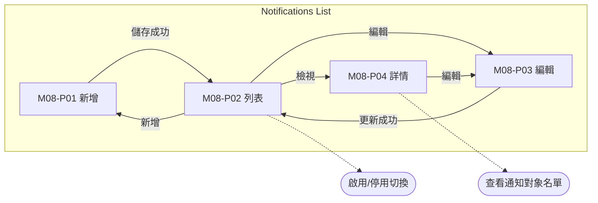
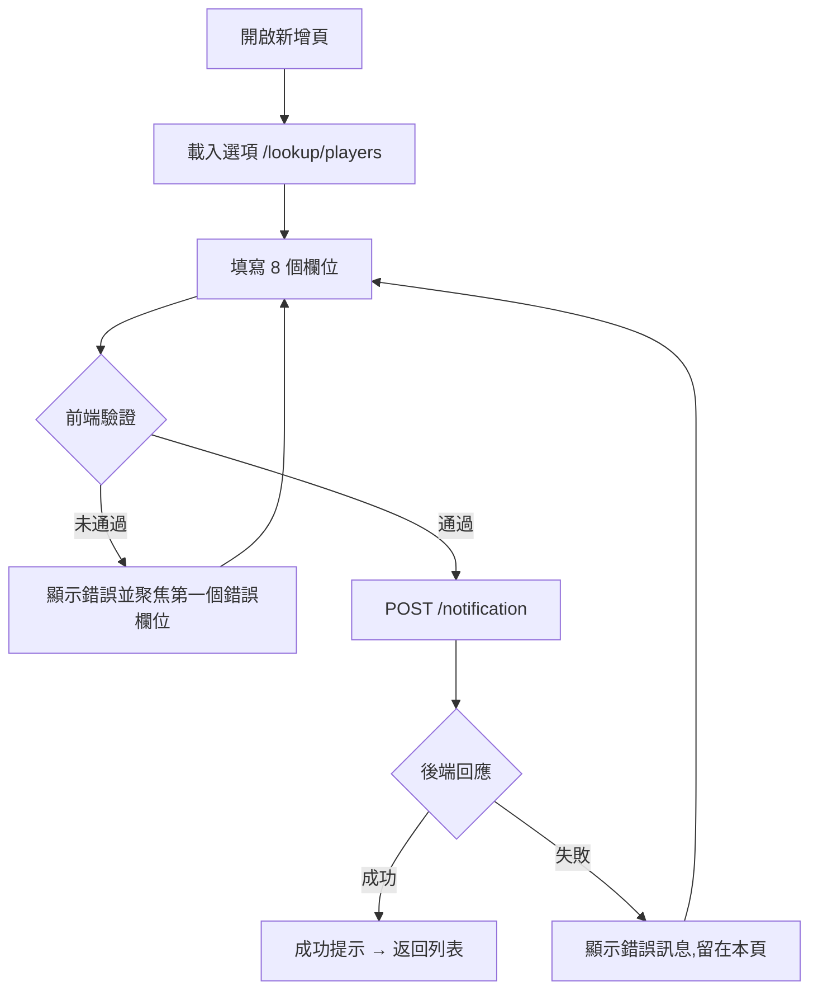
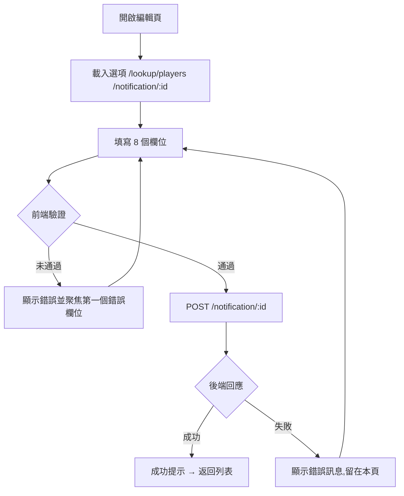

# M08 通知(Notifications)— 模塊內容與操作流程(產品)

> 資料來源:後台前端程式(版本 2.8.2)靜態分析,2026-10-05。尚未經登入後實際畫面查驗的內容,狀態標為「待實機查驗」。

## 模塊說明

建立發送給全部或指定玩家的站內通知(可設定頻率、期間、是否彈窗),並查看通知對象名單。

## 頁面一覽

| 頁面 | 名稱 | 類型 | 路由 | 主要操作 |
|---|---|---|---|---|
| M08-P01 | notifications | 新增 | `/notifications/add` | Cancel、Save |
| M08-P02 | Notifications List | 列表 | `/notifications/list` | Clear、Search、View、Edit |
| M08-P03 | notifications | 編輯 | `/notifications/update/:id` | Cancel、Update |
| M08-P04 | notifications | 詳情 | `/notifications/view/:id` | Edit、Clear、Search、View |

## 頁面流程圖

## 頁面內容與操作說明

### M08-P01 notifications(新增)

- 路由:`/notifications/add`  權限:`create:notifications-listing`
- 功能點:M08-F01 新增
- 表單欄位:Notification Name、Frequency、Start Date ~ End Date、Pop Up、Status、All Players、Player ID、Content(欄位規則見 03 開發欄位控制)
- 系統提示:「Notification created successfully」
- 實機狀態:待實機查驗

**操作步驟**

1. 開啟新增頁,系統載入下拉選項(/lookup/players)
2. 依序填寫欄位(必填欄位標示 *)
3. 按「Save」送出;前端驗證未通過時,游標跳到第一個錯誤欄位並顯示錯誤訊息
4. 驗證通過後送出 POST /notification
5. 成功:顯示成功提示並返回列表;失敗:顯示後端回傳的錯誤訊息,留在本頁
6. 按「Cancel」放棄並返回上一頁

### M08-P02 Notifications List(列表)

- 路由:`/notifications/list`  權限:`view:notifications-listing`
- 功能點:M08-F02 查詢列表、M08-F03 欄位排序、M08-F04 分頁、M08-F05 啟用/停用切換
- 表格欄位:ID、Notification Name、Start Date、End Date、Pop Up、Frequency、Status、Actions
- 篩選條件:Notification Name、Start Date (FROM) ~ Start Date (TO)、Pop Up、Frequency、Status、Items per page(欄位規則見 03 開發欄位控制)
- 系統提示:「Notification status changed successfully」
- 實機狀態:待實機查驗

**操作步驟**

1. 從側欄選單進入本頁,系統載入第一頁資料(/notification)
2. 輸入篩選條件後按「Search」查詢;按「Clear」清除條件
3. 點欄位標題排序
4. 啟用/停用切換(PUT /notification/status/:id)

### M08-P03 notifications(編輯)

- 路由:`/notifications/update/:id`  權限:`edit:notifications-listing`
- 功能點:M08-F06 編輯
- 表單欄位:Notification Name、Frequency、Start Date ~ End Date、Status、Pop Up、All Players、Player ID、Content(欄位規則見 03 開發欄位控制)
- 系統提示:「Notification updated successfully」
- 實機狀態:待實機查驗

**操作步驟**

1. 開啟編輯頁,系統載入下拉選項(/lookup/players、/notification/:id)
2. 依序填寫欄位(必填欄位標示 *)
3. 按「Update」送出;前端驗證未通過時,游標跳到第一個錯誤欄位並顯示錯誤訊息
4. 驗證通過後送出 POST /notification/:id
5. 成功:顯示成功提示並返回列表;失敗:顯示後端回傳的錯誤訊息,留在本頁
6. 按「Cancel」放棄並返回上一頁

### M08-P04 notifications(詳情)

- 路由:`/notifications/view/:id`  權限:`view:notifications-listing`
- 功能點:M08-F07 檢視詳情、M08-F08 查看通知對象名單
- 表格欄位:Player ID、Sent Date
- 表單欄位:Search Name、Start Date (FROM) ~ Start Date (TO)、Items per page(欄位規則見 03 開發欄位控制)
- 實機狀態:待實機查驗

**操作步驟**

1. 由列表按「View」進入,系統載入單筆資料(/notification/:id、/notification/:id/player_list)
2. 按「Edit」進入編輯頁

