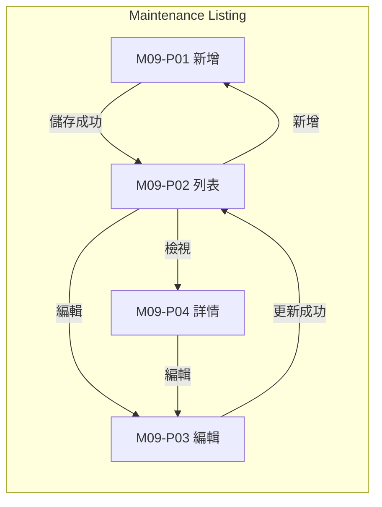
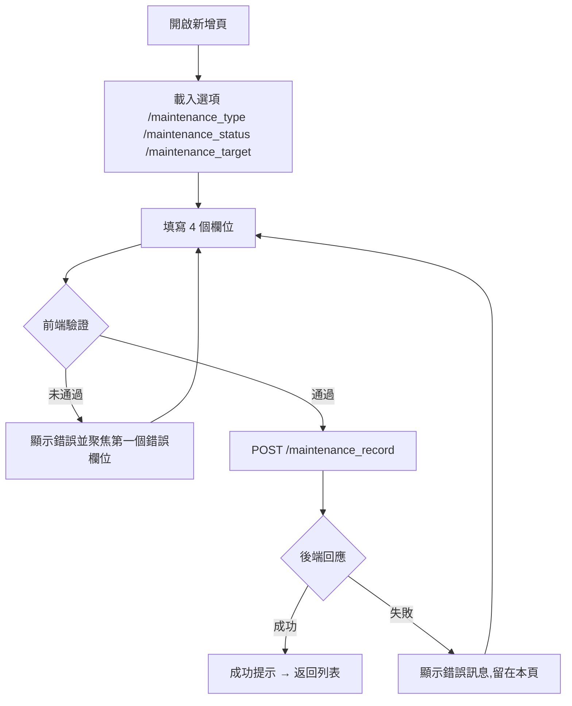
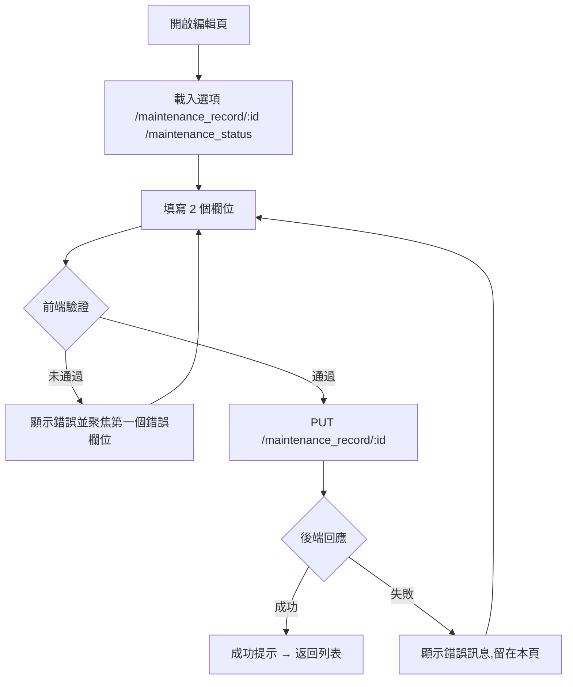

# M09 維護排程(Maintenance)— 模塊內容與操作流程(產品)

> 資料來源:後台前端程式(版本 2.8.2)靜態分析,並於 2026-10-05 以人工登入帳號實機只讀查驗(選單依該帳號角色)。各頁查驗結果見 04 測試報告。

## 模塊說明

建立系統或遊戲供應商的維護排程(類型、對象、起訖時間、原因),並更新維護狀態。

## 頁面一覽

| 頁面 | 名稱 | 類型 | 路由 | 主要操作 |
|---|---|---|---|---|
| M09-P01 | maintenance | 新增 | `/maintenance/add` | Cancel、Save |
| M09-P02 | Maintenance Listing | 列表 | `/maintenance/list` | Clear、Search、View、Edit |
| M09-P03 | maintenance | 編輯 | `/maintenance/update/:id` | Cancel、Update |
| M09-P04 | maintenance | 詳情 | `/maintenance/view/:id` | Edit |

## 頁面流程圖

## 頁面內容與操作說明

### M09-P01 maintenance(新增)

- 路由:`/maintenance/add`  權限:`create:maintenance-listing`
- 功能點:M09-F01 新增
- 表單欄位:Reason、Type、Target、Schedule Start DateTime ~ Schedule End DateTime(欄位規則見 03 開發欄位控制)
- 系統提示:「Maintenance created successfully」、「Error creating Maintenance: {error}」
- 選單位置:由列表進入;實機狀態:✅ 一致;截圖(本機,不進 git):`.playwright-output/live/maintenance_add.png`

**操作步驟**

1. 開啟新增頁,系統載入下拉選項(/maintenance_type、/maintenance_status、/maintenance_target)
2. 依序填寫欄位(必填欄位標示 *)
3. 按「Save」送出;前端驗證未通過時,游標跳到第一個錯誤欄位並顯示錯誤訊息
4. 驗證通過後送出 POST /maintenance_record
5. 成功:顯示成功提示並返回列表;失敗:顯示後端回傳的錯誤訊息,留在本頁
6. 按「Cancel」放棄並返回上一頁

### M09-P02 Maintenance Listing(列表)

- 路由:`/maintenance/list`  權限:`view:maintenance-listing`
- 功能點:M09-F02 查詢列表、M09-F03 欄位排序、M09-F04 分頁
- 表格欄位:Schedule Start DateTime、Schedule End DateTime、Reason、Type、Target、Status、Actual Start DateTime、Actual End DateTime、Created At、Actions
- 篩選條件:Type、Status、Target、Schedule Start Date (FROM) ~ Schedule Start Date (TO)、Items per page(欄位規則見 03 開發欄位控制)
- 選單位置:✅ 選單;實機狀態:✅ 一致;截圖(本機,不進 git):`.playwright-output/live/maintenance_list.png`

**操作步驟**

1. 從側欄選單進入本頁,系統載入第一頁資料(/maintenance_record、/maintenance_type、/maintenance_status、/maintenance_target)
2. 輸入篩選條件後按「Search」查詢;按「Clear」清除條件
3. 點欄位標題排序

### M09-P03 maintenance(編輯)

- 路由:`/maintenance/update/:id`  權限:`edit:maintenance-listing`
- 功能點:M09-F05 編輯
- 頁面說明:編輯頁只能改 Reason 與 Status;Type、Target、排程時間只顯示
- 表單欄位:Reason、Status(欄位規則見 03 開發欄位控制)
- 系統提示:「maintenance not found」、「Maintenance updated successfully」、「Error updating maintenance: {error}」
- 選單位置:由列表進入;實機狀態:✅ 一致;截圖(本機,不進 git):`.playwright-output/live/maintenance_update_id.png`

**操作步驟**

1. 開啟編輯頁,系統載入下拉選項(/maintenance_record/:id、/maintenance_status)
2. 依序填寫欄位(必填欄位標示 *)
3. 按「Update」送出;前端驗證未通過時,游標跳到第一個錯誤欄位並顯示錯誤訊息
4. 驗證通過後送出 PUT /maintenance_record/:id
5. 成功:顯示成功提示並返回列表;失敗:顯示後端回傳的錯誤訊息,留在本頁
6. 按「Cancel」放棄並返回上一頁

### M09-P04 maintenance(詳情)

- 路由:`/maintenance/view/:id`  權限:`view:maintenance-listing`
- 功能點:M09-F06 檢視詳情
- 顯示內容(實機):Reason、Type、Status、Target、Schedule Start DateTime、Schedule End DateTime、Actual Start DateTime、Actual End DateTime、Start By、Stop By、Created At
- 系統提示:「maintenance not found」
- 選單位置:由列表進入;實機狀態:✅ 一致;截圖(本機,不進 git):`.playwright-output/live/maintenance_view_id.png`

**操作步驟**

1. 由列表按「View」進入,系統載入單筆資料(/maintenance_record/:id)
2. 按「Edit」進入編輯頁

