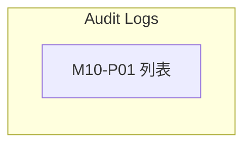

# M10 合規(Compliance)— 模塊內容與操作流程(產品)

> 資料來源:後台前端程式(版本 2.8.2)靜態分析,並於 2026-10-05 以人工登入帳號實機只讀查驗(選單依該帳號角色)。各頁查驗結果見 04 測試報告。

## 模塊說明

後台操作稽核紀錄(誰在什麼時間、從哪個 IP 做了什麼操作)。

## 頁面一覽

| 頁面 | 名稱 | 類型 | 路由 | 主要操作 |
|---|---|---|---|---|
| M10-P01 | Audit Logs | 列表 | `/audits/list` | Clear、Search |

## 頁面流程圖

## 頁面內容與操作說明

### M10-P01 Audit Logs(列表)

- 路由:`/audits/list`  權限:`view:audits`
- 功能點:M10-F01 查詢列表、M10-F02 欄位排序、M10-F03 分頁
- 表格欄位:User Name、Type、Event、Description、IP Address、User Agent、Created At
- 篩選條件:User Name、Type、Event、IP Address、IP Address、Items per page(欄位規則見 03 開發欄位控制)
- 選單位置:✅ 選單;實機狀態:✅ 一致;截圖(本機,不進 git):`.playwright-output/live/audits_list.png`

**操作步驟**

1. 從側欄選單進入本頁,系統載入第一頁資料(/audits)
2. 輸入篩選條件後按「Search」查詢;按「Clear」清除條件
3. 點欄位標題排序

