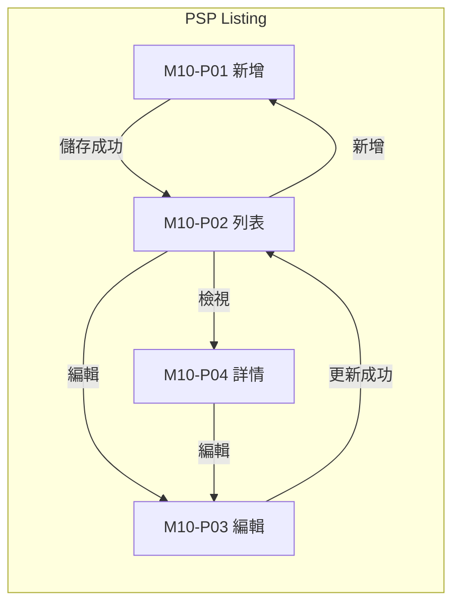
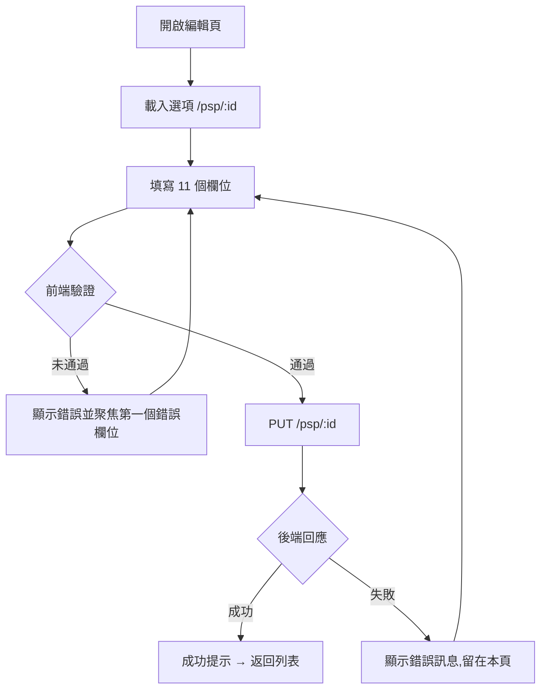

# M10 支付通道(PSP Hub)— 模塊內容與操作流程(產品)

> 資料來源:後台前端程式(版本 2.8.2)靜態分析,2026-10-05。尚未經登入後實際畫面查驗的內容,狀態標為「待實機查驗」。

## 模塊說明

管理支付服務商(PSP)通道:是否支援存款/提款、手續費、單筆上下限、圖示。

## 頁面一覽

| 頁面 | 名稱 | 類型 | 路由 | 主要操作 |
|---|---|---|---|---|
| M10-P01 | psp | 新增 | `/psp/add` | Cancel、Save |
| M10-P02 | PSP Listing | 列表 | `/psp/list` | Clear、Search、View、Edit |
| M10-P03 | psp | 編輯 | `/psp/update/:id` | Cancel、Update |
| M10-P04 | psp | 詳情 | `/psp/view/:id` | Edit |

## 頁面流程圖

## 頁面內容與操作說明

### M10-P01 psp(新增)

- 路由:`/psp/add`  權限:`create:psp`
- 功能點:M10-F01 新增
- 表單欄位:Supported formats: PNG, JPG, SVG, WebP. Maximum size: 5MB、Name、Code、External Code、Type、Category、Status、Deposit Capability、Withdrawal Capability、Service Fee、Maximum Limit、Minimum Limit、Service Fee、Maximum Limit、Minimum Limit(欄位規則見 03 開發欄位控制)
- 系統提示:「PSP created successfully」、「Error creating PSP: {error}」
- 實機狀態:待實機查驗

**操作步驟**

1. 開啟新增頁,系統載入下拉選項
2. 依序填寫欄位(必填欄位標示 *)
3. 按「Save」送出;前端驗證未通過時,游標跳到第一個錯誤欄位並顯示錯誤訊息
4. 驗證通過後送出 POST /psp
5. 成功:顯示成功提示並返回列表;失敗:顯示後端回傳的錯誤訊息,留在本頁
6. 按「Cancel」放棄並返回上一頁

### M10-P02 PSP Listing(列表)

- 路由:`/psp/list`  權限:`view:psp`
- 功能點:M10-F02 查詢列表、M10-F03 欄位排序、M10-F04 分頁
- 表格欄位:Icon、Name、Code、Type、Category、Deposit Capability、Withdrawal Capability、Status、Created At、Updated At、Actions
- 篩選條件:Name、Code、External Code、Type、Category、Status、Deposit Capability、Withdrawal Capability、Items per page(欄位規則見 03 開發欄位控制)
- 系統提示:「PSP status changed successfully」
- 實機狀態:待實機查驗

**操作步驟**

1. 從側欄選單進入本頁,系統載入第一頁資料(/psp)
2. 輸入篩選條件後按「Search」查詢;按「Clear」清除條件
3. 點欄位標題排序

### M10-P03 psp(編輯)

- 路由:`/psp/update/:id`  權限:`edit:psp`
- 功能點:M10-F05 編輯
- 表單欄位:Supported formats: PNG, JPG, SVG, WebP. Maximum size: 5MB、Name、Status、Deposit Capability、Withdrawal Capability、Service Fee、Maximum Limit、Minimum Limit、Service Fee、Maximum Limit、Minimum Limit(欄位規則見 03 開發欄位控制)
- 系統提示:「PSP not found」、「Error fetching PSP details: {error}」、「PSP updated successfully」、「Error updating PSP: {error}」
- 實機狀態:待實機查驗

**操作步驟**

1. 開啟編輯頁,系統載入下拉選項(/psp/:id)
2. 依序填寫欄位(必填欄位標示 *)
3. 按「Update」送出;前端驗證未通過時,游標跳到第一個錯誤欄位並顯示錯誤訊息
4. 驗證通過後送出 PUT /psp/:id
5. 成功:顯示成功提示並返回列表;失敗:顯示後端回傳的錯誤訊息,留在本頁
6. 按「Cancel」放棄並返回上一頁

### M10-P04 psp(詳情)

- 路由:`/psp/view/:id`  權限:`view:psp`
- 功能點:M10-F06 檢視詳情
- 系統提示:「PSP not found」
- 實機狀態:待實機查驗

**操作步驟**

1. 由列表按「View」進入,系統載入單筆資料(/psp/:id)
2. 按「Edit」進入編輯頁

