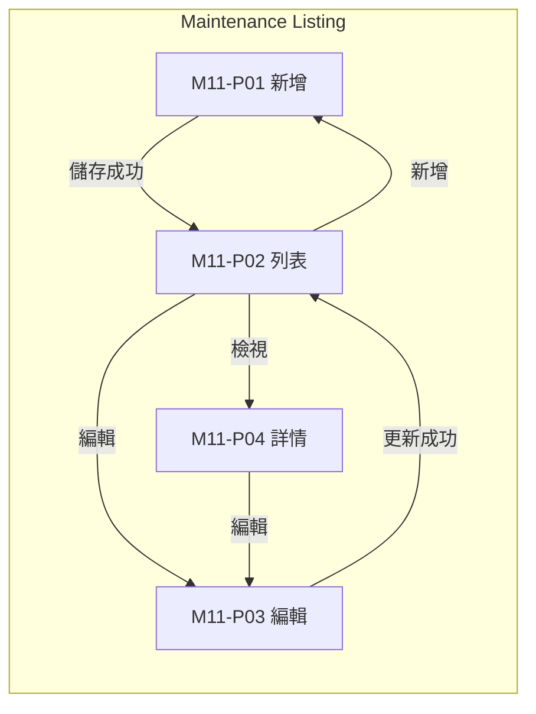
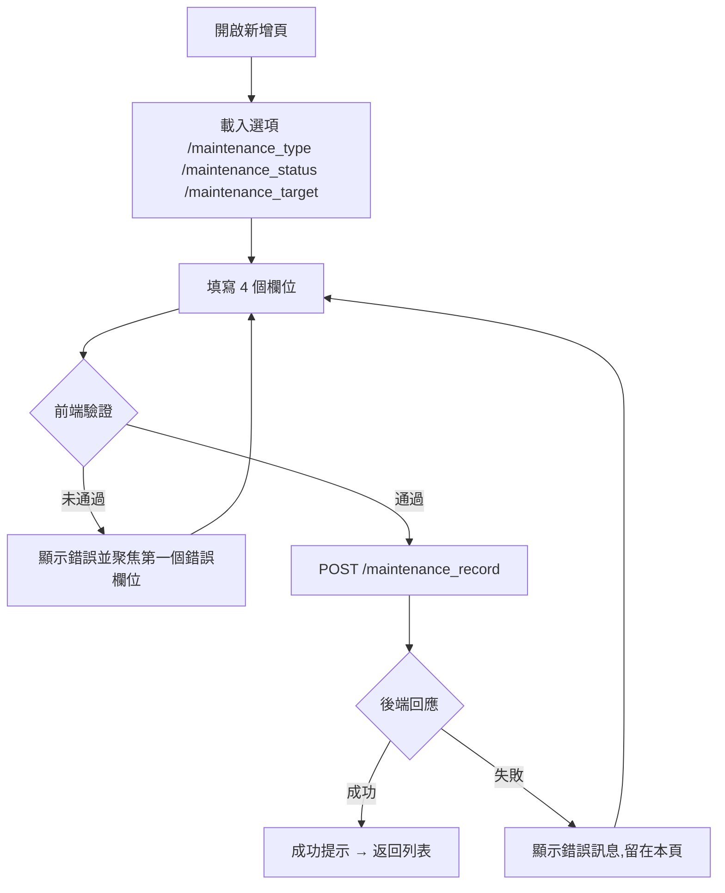
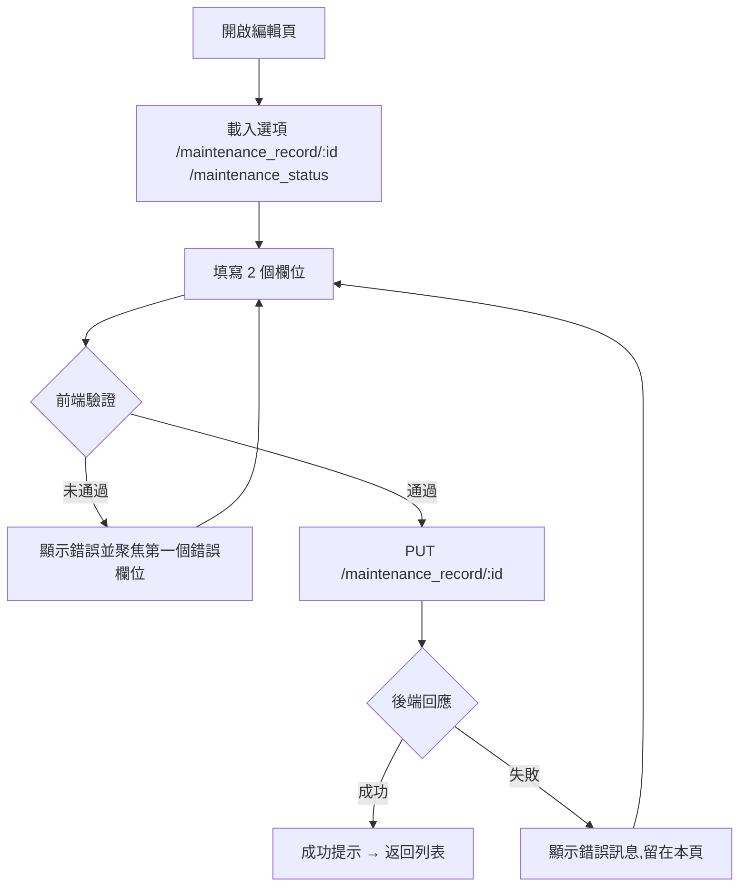

# M11 維護排程(Maintenance)— 模塊內容與操作流程(產品)

> 資料來源:後台前端程式(版本 2.8.2)靜態分析,2026-10-05。尚未經登入後實際畫面查驗的內容,狀態標為「待實機查驗」。

## 模塊說明

建立系統或遊戲供應商的維護排程(類型、對象、起訖時間、原因),並更新維護狀態。

## 頁面一覽

| 頁面 | 名稱 | 類型 | 路由 | 主要操作 |
|---|---|---|---|---|
| M11-P01 | maintenance | 新增 | `/maintenance/add` | Cancel、Save |
| M11-P02 | Maintenance Listing | 列表 | `/maintenance/list` | Clear、Search、View、Edit |
| M11-P03 | maintenance | 編輯 | `/maintenance/update/:id` | Cancel、Update |
| M11-P04 | maintenance | 詳情 | `/maintenance/view/:id` | Edit |

## 頁面流程圖

## 頁面內容與操作說明

### M11-P01 maintenance(新增)

- 路由:`/maintenance/add`  權限:`create:maintenance-listing`
- 功能點:M11-F01 新增
- 表單欄位:Reason、Type、Target、Schedule Start DateTime ~ Schedule End DateTime(欄位規則見 03 開發欄位控制)
- 系統提示:「Maintenance created successfully」、「Error creating Maintenance: {error}」
- 實機狀態:待實機查驗

**操作步驟**

1. 開啟新增頁,系統載入下拉選項(/maintenance_type、/maintenance_status、/maintenance_target)
2. 依序填寫欄位(必填欄位標示 *)
3. 按「Save」送出;前端驗證未通過時,游標跳到第一個錯誤欄位並顯示錯誤訊息
4. 驗證通過後送出 POST /maintenance_record
5. 成功:顯示成功提示並返回列表;失敗:顯示後端回傳的錯誤訊息,留在本頁
6. 按「Cancel」放棄並返回上一頁

### M11-P02 Maintenance Listing(列表)

- 路由:`/maintenance/list`  權限:`view:maintenance-listing`
- 功能點:M11-F02 查詢列表、M11-F03 欄位排序、M11-F04 分頁
- 表格欄位:Schedule Start DateTime、Schedule End DateTime、Reason、Type、Target、Status、Actual Start DateTime、Actual End DateTime、Created At、Actions
- 篩選條件:Type、Status、Target、Schedule Start Date (FROM) ~ Schedule Start Date (TO)、Items per page(欄位規則見 03 開發欄位控制)
- 實機狀態:待實機查驗

**操作步驟**

1. 從側欄選單進入本頁,系統載入第一頁資料(/maintenance_record、/maintenance_type、/maintenance_status、/maintenance_target)
2. 輸入篩選條件後按「Search」查詢;按「Clear」清除條件
3. 點欄位標題排序

### M11-P03 maintenance(編輯)

- 路由:`/maintenance/update/:id`  權限:`edit:maintenance-listing`
- 功能點:M11-F05 編輯
- 表單欄位:Reason、Status(欄位規則見 03 開發欄位控制)
- 系統提示:「maintenance not found」、「Maintenance updated successfully」、「Error updating maintenance: {error}」
- 實機狀態:待實機查驗

**操作步驟**

1. 開啟編輯頁,系統載入下拉選項(/maintenance_record/:id、/maintenance_status)
2. 依序填寫欄位(必填欄位標示 *)
3. 按「Update」送出;前端驗證未通過時,游標跳到第一個錯誤欄位並顯示錯誤訊息
4. 驗證通過後送出 PUT /maintenance_record/:id
5. 成功:顯示成功提示並返回列表;失敗:顯示後端回傳的錯誤訊息,留在本頁
6. 按「Cancel」放棄並返回上一頁

### M11-P04 maintenance(詳情)

- 路由:`/maintenance/view/:id`  權限:`view:maintenance-listing`
- 功能點:M11-F06 檢視詳情
- 系統提示:「maintenance not found」
- 實機狀態:待實機查驗

**操作步驟**

1. 由列表按「View」進入,系統載入單筆資料(/maintenance_record/:id)
2. 按「Edit」進入編輯頁

