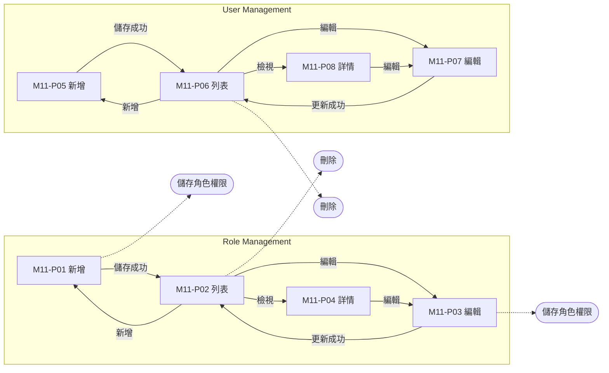
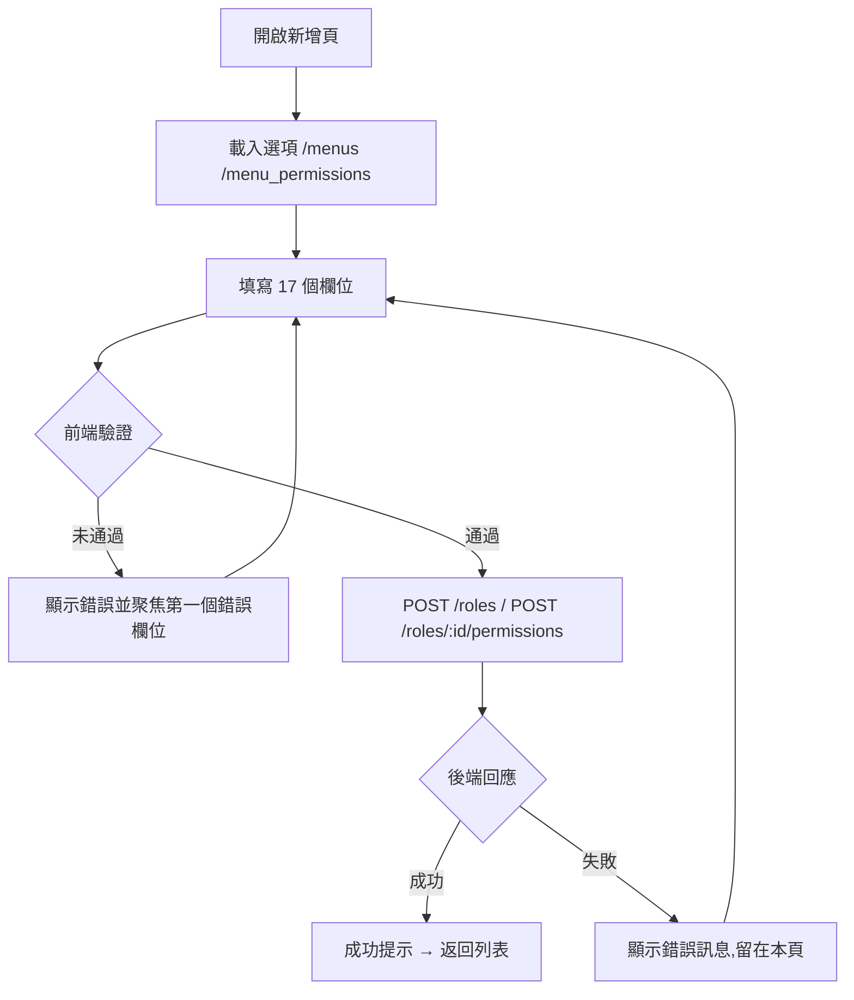
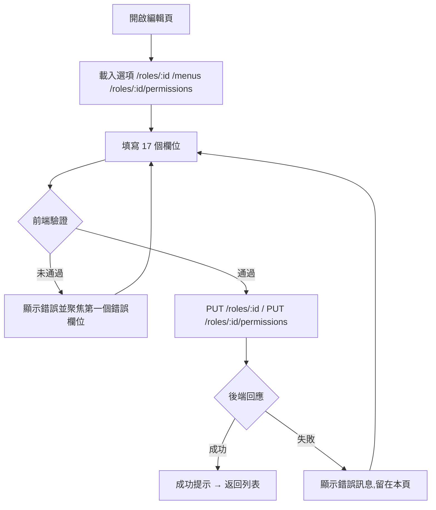
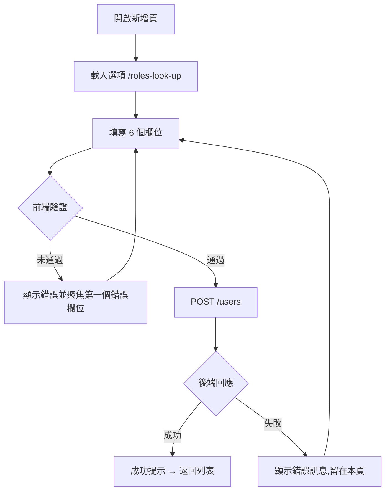
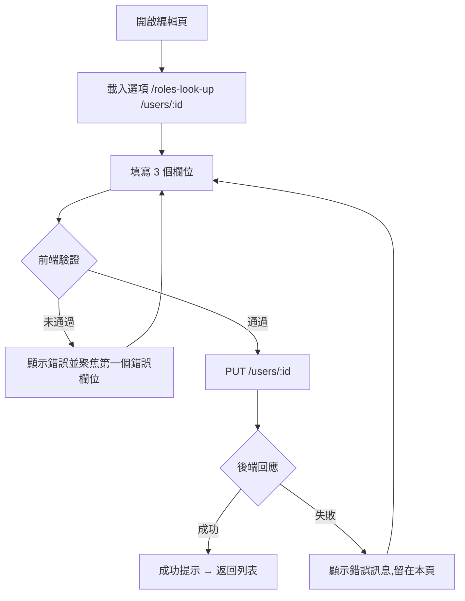

# M11 系統設定(Settings)— 模塊內容與操作流程(產品)

> 資料來源:後台前端程式(版本 2.8.2)靜態分析,並於 2026-10-05 以人工登入帳號實機只讀查驗(選單依該帳號角色)。各頁查驗結果見 04 測試報告。

## 模塊說明

管理後台使用者帳號與角色權限(選單權限勾選),決定每個使用者看得到哪些模塊、能做哪些操作。

## 頁面一覽

| 頁面 | 名稱 | 類型 | 路由 | 主要操作 |
|---|---|---|---|---|
| M11-P01 | roles | 新增 | `/roles/add` | Cancel、Save |
| M11-P02 | Role Management | 列表 | `/roles/list` | Clear、Search、View、Edit |
| M11-P03 | roles | 編輯 | `/roles/update/:id` | Cancel、Save |
| M11-P04 | roles | 詳情 | `/roles/view/:id` | Edit |
| M11-P05 | users | 新增 | `/users/add` | Cancel、Save |
| M11-P06 | User Management | 列表 | `/users/list` | Clear、Search、View、Edit |
| M11-P07 | users | 編輯 | `/users/update/:id` | Cancel、Update |
| M11-P08 | users | 詳情 | `/users/view/:id` | Edit |

## 頁面流程圖

## 頁面內容與操作說明

### M11-P01 roles(新增)

- 路由:`/roles/add`  權限:`create:roles`
- 功能點:M11-F01 新增、M11-F02 儲存角色權限
- 頁面說明:權限勾選區上方有搜尋框可篩選選單
- 表格欄位(實機):Module、View、Edit、Create、Approve、Select All
- 表單欄位:Name、Code、Description、Status、Select All、Select All、Select All、VCheckbox、VCheckbox、Select All、Select All、Select All、VCheckbox、Select All、Select All、Select All、VCheckbox(欄位規則見 03 開發欄位控制)
- 系統提示:「Role created successfully」
- 選單位置:由列表進入;實機狀態:✅ 一致;截圖(本機,不進 git):`.playwright-output/live/roles_add.png`

**操作步驟**

1. 開啟新增頁,系統載入下拉選項(/menus、/menu_permissions)
2. 依序填寫欄位(必填欄位標示 *)
3. 按「Save」送出;前端驗證未通過時,游標跳到第一個錯誤欄位並顯示錯誤訊息
4. 驗證通過後送出 POST /roles、POST /roles/:id/permissions
5. 成功:顯示成功提示並返回列表;失敗:顯示後端回傳的錯誤訊息,留在本頁
6. 按「Cancel」放棄並返回上一頁

### M11-P02 Role Management(列表)

- 路由:`/roles/list`  權限:`view:roles`
- 功能點:M11-F03 查詢列表、M11-F04 欄位排序、M11-F05 分頁、M11-F06 刪除
- 表格欄位:Name、Code、Description、Status、Created At、Updated At、Actions
- 篩選條件:Name、Code、Status、Items per page(欄位規則見 03 開發欄位控制)
- 系統提示:「Role deleted successfully」、「Role status changed successfully」
- 選單位置:✅ 選單;實機狀態:✅ 一致;截圖(本機,不進 git):`.playwright-output/live/roles_list.png`

**操作步驟**

1. 從側欄選單進入本頁,系統載入第一頁資料(/roles)
2. 輸入篩選條件後按「Search」查詢;按「Clear」清除條件
3. 點欄位標題排序
4. 刪除(DELETE /roles/:id)

### M11-P03 roles(編輯)

- 路由:`/roles/update/:id`  權限:`edit:roles`
- 功能點:M11-F07 編輯、M11-F08 儲存角色權限
- 表格欄位(實機):Module、View、Edit、Create、Approve、Select All
- 表單欄位:Name、Code、Description、Status、Select All、Select All、Select All、VCheckbox、VCheckbox、Select All、Select All、Select All、VCheckbox、Select All、Select All、Select All、VCheckbox(欄位規則見 03 開發欄位控制)
- 系統提示:「Role updated successfully」
- 選單位置:由列表進入;實機狀態:✅ 一致;截圖(本機,不進 git):`.playwright-output/live/roles_update_id.png`

**操作步驟**

1. 開啟編輯頁,系統載入下拉選項(/roles/:id、/menus、/roles/:id/permissions)
2. 依序填寫欄位(必填欄位標示 *)
3. 按「Save」送出;前端驗證未通過時,游標跳到第一個錯誤欄位並顯示錯誤訊息
4. 驗證通過後送出 PUT /roles/:id、PUT /roles/:id/permissions
5. 成功:顯示成功提示並返回列表;失敗:顯示後端回傳的錯誤訊息,留在本頁
6. 按「Cancel」放棄並返回上一頁

### M11-P04 roles(詳情)

- 路由:`/roles/view/:id`  權限:`view:roles`
- 功能點:M11-F09 檢視詳情
- 表格欄位(實機):Module、View、Edit、Create、Approve
- 顯示內容(實機):Name、Code、Description、Status、Created By、Updated By、Created At、Updated At
- 系統提示:「Role not found」、「No data available」
- 選單位置:由列表進入;實機狀態:✅ 一致;截圖(本機,不進 git):`.playwright-output/live/roles_view_id.png`

**操作步驟**

1. 由列表按「View」進入,系統載入單筆資料(/roles/:id、/menus、/roles/:id/permissions)
2. 按「Edit」進入編輯頁

### M11-P05 users(新增)

- 路由:`/users/add`  權限:`create:users`
- 功能點:M11-F10 新增
- 表單欄位:Name、Email、Password、Confirm Password、Role、Active Status(欄位規則見 03 開發欄位控制)
- 系統提示:「Password and confirm password do not match」、「User created successfully」、「Game creation failed: {error}」
- 選單位置:由列表進入;實機狀態:✅ 一致;截圖(本機,不進 git):`.playwright-output/live/users_add.png`

**操作步驟**

1. 開啟新增頁,系統載入下拉選項(/roles-look-up)
2. 依序填寫欄位(必填欄位標示 *)
3. 按「Save」送出;前端驗證未通過時,游標跳到第一個錯誤欄位並顯示錯誤訊息
4. 驗證通過後送出 POST /users
5. 成功:顯示成功提示並返回列表;失敗:顯示後端回傳的錯誤訊息,留在本頁
6. 按「Cancel」放棄並返回上一頁

### M11-P06 User Management(列表)

- 路由:`/users/list`  權限:`view:users`
- 功能點:M11-F11 查詢列表、M11-F12 欄位排序、M11-F13 分頁、M11-F14 刪除
- 表格欄位:Name、Email、Role、Status、Created At、Updated At、Actions
- 篩選條件:Name、Email、Role、Status、Items per page(欄位規則見 03 開發欄位控制)
- 系統提示:「User deleted successfully」、「User status changed successfully」、「Password and confirm password do not match」、「User password updated successfully」
- 選單位置:✅ 選單;實機狀態:✅ 一致;截圖(本機,不進 git):`.playwright-output/live/users_list.png`

**操作步驟**

1. 從側欄選單進入本頁,系統載入第一頁資料(/roles-look-up、/users)
2. 輸入篩選條件後按「Search」查詢;按「Clear」清除條件
3. 點欄位標題排序
4. 刪除(DELETE /users/:id)

### M11-P07 users(編輯)

- 路由:`/users/update/:id`  權限:`edit:users`
- 功能點:M11-F15 編輯
- 表單欄位:Name、Email、Role(欄位規則見 03 開發欄位控制)
- 系統提示:「User not found」、「User updated successfully」、「Error updating user: {error}」
- 選單位置:由列表進入;實機狀態:✅ 一致;截圖(本機,不進 git):`.playwright-output/live/users_update_id.png`

**操作步驟**

1. 開啟編輯頁,系統載入下拉選項(/roles-look-up、/users/:id)
2. 依序填寫欄位(必填欄位標示 *)
3. 按「Update」送出;前端驗證未通過時,游標跳到第一個錯誤欄位並顯示錯誤訊息
4. 驗證通過後送出 PUT /users/:id
5. 成功:顯示成功提示並返回列表;失敗:顯示後端回傳的錯誤訊息,留在本頁
6. 按「Cancel」放棄並返回上一頁

### M11-P08 users(詳情)

- 路由:`/users/view/:id`  權限:`view:users`
- 功能點:M11-F16 檢視詳情
- 顯示內容(實機):Name、Email、Role、Status、Created By、Created At、Updated By、Updated At
- 系統提示:「User not found」
- 選單位置:由列表進入;實機狀態:✅ 一致;截圖(本機,不進 git):`.playwright-output/live/users_view_id.png`

**操作步驟**

1. 由列表按「View」進入,系統載入單筆資料(/users/:id)
2. 按「Edit」進入編輯頁

