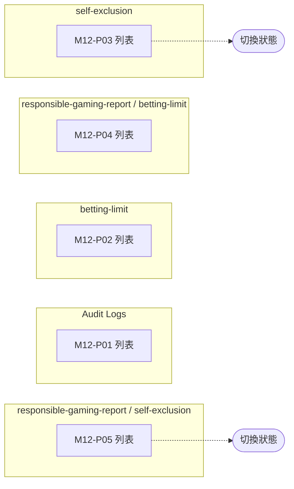

# M12 合規與責任博彩(Compliance)— 模塊內容與操作流程(產品)

> 資料來源:後台前端程式(版本 2.8.2)靜態分析,2026-10-05。尚未經登入後實際畫面查驗的內容,狀態標為「待實機查驗」。

## 模塊說明

後台操作稽核紀錄,以及責任博彩相關報表:自我排除名單(可切換狀態)、投注限額變更與高使用率名單。

## 頁面一覽

| 頁面 | 名稱 | 類型 | 路由 | 主要操作 |
|---|---|---|---|---|
| M12-P01 | Audit Logs | 列表 | `/audits/list` | Clear、Search |
| M12-P02 | betting-limit | 列表 | `/reports/betting-limit/list` | Clear、Download CSV、Search |
| M12-P03 | self-exclusion | 列表 | `/reports/self-exclusion/list` | Clear、Download CSV、Search |
| M12-P04 | responsible-gaming-report / betting-limit | 列表 | `/responsible-gaming-report/betting-limit/list` | Clear、Download CSV、Search |
| M12-P05 | responsible-gaming-report / self-exclusion | 列表 | `/responsible-gaming-report/self-exclusion/list` | Clear、Download CSV、Search |

## 頁面流程圖

## 頁面內容與操作說明

### M12-P01 Audit Logs(列表)

- 路由:`/audits/list`  權限:`view:audits`
- 功能點:M12-F01 查詢列表、M12-F02 欄位排序、M12-F03 分頁
- 表格欄位:User Name、Type、Event、Description、IP Address、User Agent、Created At
- 篩選條件:User Name、Type、Event、IP Address、IP Address、Items per page(欄位規則見 03 開發欄位控制)
- 實機狀態:待實機查驗

**操作步驟**

1. 從側欄選單進入本頁,系統載入第一頁資料(/audits)
2. 輸入篩選條件後按「Search」查詢;按「Clear」清除條件
3. 點欄位標題排序

### M12-P02 betting-limit(列表)

- 路由:`/reports/betting-limit/list`  權限:`view:betting-limit-report`
- 功能點:M12-F04 查詢列表、M12-F05 分頁、M12-F06 匯出
- 篩選條件:Member ID、Status、Limit Period、Items per page(欄位規則見 03 開發欄位控制)
- 系統提示:「An unexpected error occurred」、「Filters cleared successfully」、「Downloaded successfully」
- 實機狀態:待實機查驗

**操作步驟**

1. 從側欄選單進入本頁,系統載入第一頁資料(/report/betting_limit/player、/report/betting_limit/limit_change、/report/betting_limit/high_usage)
2. 輸入篩選條件後按「Search」查詢;按「Clear」清除條件
3. 按「Download CSV / Download」匯出目前查詢結果

### M12-P03 self-exclusion(列表)

- 路由:`/reports/self-exclusion/list`  權限:`view:self-exclusion-report`
- 功能點:M12-F07 查詢列表、M12-F08 欄位排序、M12-F09 分頁、M12-F10 匯出、M12-F11 切換狀態
- 表格欄位:Status、Actions
- 篩選條件:Member ID、Status、Items per page、common.actions.search(欄位規則見 03 開發欄位控制)
- 系統提示:「An unexpected error occurred」、「Filters cleared successfully」
- 實機狀態:待實機查驗

**操作步驟**

1. 從側欄選單進入本頁,系統載入第一頁資料(/report/self_exclusion/list)
2. 輸入篩選條件後按「Search」查詢;按「Clear」清除條件
3. 點欄位標題排序
4. 按「Download CSV / Download」匯出目前查詢結果
5. 切換狀態(POST /report/self_exclusion/toggle_status)

### M12-P04 responsible-gaming-report / betting-limit(列表)

- 路由:`/responsible-gaming-report/betting-limit/list`  權限:`view:betting-limit-report`
- 功能點:M12-F12 查詢列表、M12-F13 分頁、M12-F14 匯出
- 篩選條件:Player ID、Status、Limit Period、Items per page(欄位規則見 03 開發欄位控制)
- 系統提示:「An unexpected error occurred」、「Filters cleared successfully」、「Downloaded successfully」
- 實機狀態:待實機查驗

**操作步驟**

1. 從側欄選單進入本頁,系統載入第一頁資料(/report/betting_limit/player、/report/betting_limit/limit_change、/report/betting_limit/high_usage)
2. 輸入篩選條件後按「Search」查詢;按「Clear」清除條件
3. 按「Download CSV / Download」匯出目前查詢結果

### M12-P05 responsible-gaming-report / self-exclusion(列表)

- 路由:`/responsible-gaming-report/self-exclusion/list`  權限:`view:self-exclusion-report`
- 功能點:M12-F15 查詢列表、M12-F16 欄位排序、M12-F17 分頁、M12-F18 匯出、M12-F19 切換狀態
- 表格欄位:Status、Actions
- 篩選條件:Player ID、Status、Items per page、common.actions.search(欄位規則見 03 開發欄位控制)
- 系統提示:「An unexpected error occurred」、「Filters cleared successfully」
- 實機狀態:待實機查驗

**操作步驟**

1. 從側欄選單進入本頁,系統載入第一頁資料(/report/self_exclusion/list)
2. 輸入篩選條件後按「Search」查詢;按「Clear」清除條件
3. 點欄位標題排序
4. 按「Download CSV / Download」匯出目前查詢結果
5. 切換狀態(POST /report/self_exclusion/toggle_status)

