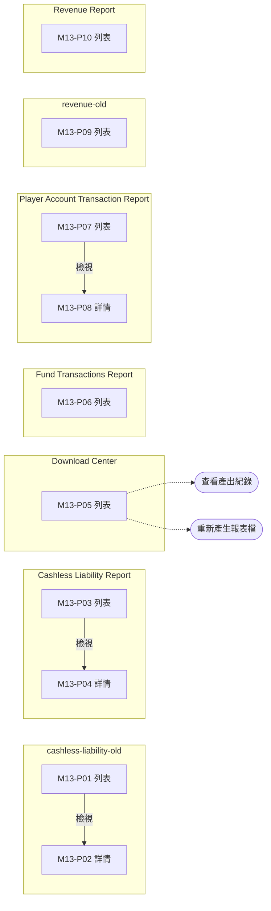

# M13 報表(Reports)— 模塊內容與操作流程(產品)

> 資料來源:後台前端程式(版本 2.8.2)靜態分析,2026-10-05。尚未經登入後實際畫面查驗的內容,狀態標為「待實機查驗」。

## 模塊說明

財務與營運報表:無現金負債、資金交易、玩家帳戶交易、營收報表(含舊版),以及非同步匯出的下載中心。

## 頁面一覽

| 頁面 | 名稱 | 類型 | 路由 | 主要操作 |
|---|---|---|---|---|
| M13-P01 | cashless-liability-old | 列表 | `/reports/cashless-liability-old/list` | Download CSV、Search、View |
| M13-P02 | Player Cashless Liability | 詳情 | `/reports/cashless-liability-old/view/:id` | Clear、Download CSV、Search、Edit |
| M13-P03 | Cashless Liability Report | 列表 | `/reports/cashless-liability/list` | Download CSV、Search、View |
| M13-P04 | Player Cashless Liability | 詳情 | `/reports/cashless-liability/view/:id` | Clear、Download CSV、Search、Edit |
| M13-P05 | Download Center | 列表 | `/reports/download-center/list` | Clear、Search |
| M13-P06 | Fund Transactions Report | 列表 | `/reports/fund-transaction/list` | Clear、Download CSV、Search |
| M13-P07 | Player Account Transaction Report | 列表 | `/reports/player-account-transaction/list` | Clear、Download CSV、Search、View |
| M13-P08 | Player Cashless Liability | 詳情 | `/reports/player-account-transaction/view/:id` | Clear、Download CSV、Search、Edit |
| M13-P09 | revenue-old | 列表 | `/reports/revenue-old/list` | Clear、Download CSV、Search |
| M13-P10 | Revenue Report | 列表 | `/reports/revenue/list` | Clear、Download CSV、Search |

## 頁面流程圖

## 頁面內容與操作說明

### M13-P01 cashless-liability-old(列表)

- 路由:`/reports/cashless-liability-old/list`  權限:`view:cashless-liability-report`
- 功能點:M13-F01 查詢列表、M13-F02 欄位排序、M13-F03 分頁、M13-F04 匯出
- 表格欄位:Gaming Date、Total Wallets、iGaming Wallet、iGaming Bonus Wallet、Total Provider Wallet、Actions
- 篩選條件:Cashless Liability Report - Old、Items per page(欄位規則見 03 開發欄位控制)
- 實機狀態:待實機查驗

**操作步驟**

1. 從側欄選單進入本頁,系統載入第一頁資料(/report/cashless/list)
2. 輸入篩選條件後按「Search」查詢;按「Clear」清除條件
3. 點欄位標題排序
4. 按「Download CSV / Download」匯出目前查詢結果

### M13-P02 Player Cashless Liability(詳情)

- 路由:`/reports/cashless-liability-old/view/:id`  權限:`view:cashless-liability-report`
- 功能點:M13-F05 檢視詳情
- 表格欄位:Player ID、iGaming Wallet、iGaming Bonus Wallet、Total Provider Wallet、Gaming Date
- 表單欄位:navigation.submenu.playerCashlessLiability、Items per page(欄位規則見 03 開發欄位控制)
- 實機狀態:待實機查驗

**操作步驟**

1. 由列表按「View」進入,系統載入單筆資料(/report/cashless/player/list)
2. 按「Edit」進入編輯頁

### M13-P03 Cashless Liability Report(列表)

- 路由:`/reports/cashless-liability/list`  權限:`view:cashless-liability-report`
- 功能點:M13-F06 查詢列表、M13-F07 欄位排序、M13-F08 分頁、M13-F09 匯出
- 表格欄位:Gaming Date、Total Wallets、iGaming Wallet、iGaming Bonus Wallet、Total Provider Wallet、Actions
- 篩選條件:Cashless Liability Report、Items per page(欄位規則見 03 開發欄位控制)
- 實機狀態:待實機查驗

**操作步驟**

1. 從側欄選單進入本頁,系統載入第一頁資料(/report/cashless/list)
2. 輸入篩選條件後按「Search」查詢;按「Clear」清除條件
3. 點欄位標題排序
4. 按「Download CSV / Download」匯出目前查詢結果

### M13-P04 Player Cashless Liability(詳情)

- 路由:`/reports/cashless-liability/view/:id`  權限:`view:cashless-liability-report`
- 功能點:M13-F10 檢視詳情
- 表格欄位:Player ID、iGaming Wallet、iGaming Bonus Wallet、Total Provider Wallet、Gaming Date
- 表單欄位:navigation.submenu.playerCashlessLiability、Items per page(欄位規則見 03 開發欄位控制)
- 實機狀態:待實機查驗

**操作步驟**

1. 由列表按「View」進入,系統載入單筆資料(/report/cashless/player/list)
2. 按「Edit」進入編輯頁

### M13-P05 Download Center(列表)

- 路由:`/reports/download-center/list`  權限:`view:download-center`
- 功能點:M13-F11 查詢列表、M13-F12 分頁、M13-F13 查看產出紀錄、M13-F14 重新產生報表檔
- 表格欄位:Report Name、Filters、Status、File Size、Requested By、Requested At、Expires At、Downloads、Actions
- 篩選條件:Report Name、Status、Requested From ~ Requested To、Items per page(欄位規則見 03 開發欄位控制)
- 系統提示:「This export is not ready for download」、「Regenerate requested — this export will process again shortly」、「Downloading… {percent}%」、「Downloading…」
- 實機狀態:待實機查驗

**操作步驟**

1. 從側欄選單進入本頁,系統載入第一頁資料(/report/downloads、/report/downloads/:id/logs)
2. 輸入篩選條件後按「Search」查詢;按「Clear」清除條件
3. 重新產生報表檔(POST /report/downloads/:id/regenerate)

### M13-P06 Fund Transactions Report(列表)

- 路由:`/reports/fund-transaction/list`  權限:`view:fund-transaction-report`
- 功能點:M13-F15 查詢列表、M13-F16 欄位排序、M13-F17 分頁、M13-F18 匯出
- 表格欄位:Player ID、Transaction Type、Wallet From、Wallet To、Ref ID、Transaction Date、Status、Before Balance、Transaction Amount、After Balance、Remarks
- 篩選條件:Fund Transactions Report、Player ID、Transaction Type、Status、Ref ID、Items per page(欄位規則見 03 開發欄位控制)
- 實機狀態:待實機查驗

**操作步驟**

1. 從側欄選單進入本頁,系統載入第一頁資料(/report/fund_transaction/list、/report/fund_transaction/trasaction_type_list)
2. 輸入篩選條件後按「Search」查詢;按「Clear」清除條件
3. 點欄位標題排序
4. 按「Download CSV / Download」匯出目前查詢結果

### M13-P07 Player Account Transaction Report(列表)

- 路由:`/reports/player-account-transaction/list`  權限:`view:player-account-transaction-report`
- 功能點:M13-F19 查詢列表、M13-F20 欄位排序、M13-F21 分頁、M13-F22 匯出
- 表格欄位:ID、Player ID、Provider Name、Turnover、Actual Win、Ref ID、Transaction Date Time
- 篩選條件:Player Account Transaction Report、Player ID、Items per page(欄位規則見 03 開發欄位控制)
- 實機狀態:待實機查驗

**操作步驟**

1. 從側欄選單進入本頁,系統載入第一頁資料(/lookup/players、/report/player-account-transaction/:id)
2. 輸入篩選條件後按「Search」查詢;按「Clear」清除條件
3. 點欄位標題排序
4. 按「Download CSV / Download」匯出目前查詢結果

### M13-P08 Player Cashless Liability(詳情)

- 路由:`/reports/player-account-transaction/view/:id`  權限:`view:cashless-liability-report`
- 功能點:M13-F23 檢視詳情
- 表格欄位:Player ID、iGaming Wallet、iGaming Bonus Wallet、Total Provider Wallet、Gaming Date
- 表單欄位:navigation.submenu.playerCashlessLiability、Items per page(欄位規則見 03 開發欄位控制)
- 實機狀態:待實機查驗

**操作步驟**

1. 由列表按「View」進入,系統載入單筆資料(/report/cashless/player/list)
2. 按「Edit」進入編輯頁

### M13-P09 revenue-old(列表)

- 路由:`/reports/revenue-old/list`  權限:`view:revenue-report`
- 功能點:M13-F24 查詢列表、M13-F25 分頁、M13-F26 匯出
- 表格欄位:
- 篩選條件:Provider、Game Category、Game Offering、Game、End Date、Most Recent、Most Recent(欄位規則見 03 開發欄位控制)
- 系統提示:「An unexpected error occurred」、「Filters cleared successfully」、「CSV downloaded successfully」
- 實機狀態:待實機查驗

**操作步驟**

1. 從側欄選單進入本頁,系統載入第一頁資料(/get_e_provider_list、/game_offerings_dropdown、/report/revenue、/get_game_list)
2. 輸入篩選條件後按「Search」查詢;按「Clear」清除條件
3. 按「Download CSV / Download」匯出目前查詢結果

### M13-P10 Revenue Report(列表)

- 路由:`/reports/revenue/list`  權限:`view:revenue-report`
- 功能點:M13-F27 查詢列表、M13-F28 分頁、M13-F29 匯出
- 表格欄位:
- 篩選條件:Provider、Game Category、Game Offering、Game、End Date、Most Recent、Most Recent(欄位規則見 03 開發欄位控制)
- 系統提示:「An unexpected error occurred」、「Filters cleared successfully」、「CSV downloaded successfully」
- 實機狀態:待實機查驗

**操作步驟**

1. 從側欄選單進入本頁,系統載入第一頁資料(/get_e_provider_list、/game_offerings_dropdown、/report/revenue、/get_game_list)
2. 輸入篩選條件後按「Search」查詢;按「Clear」清除條件
3. 按「Download CSV / Download」匯出目前查詢結果

