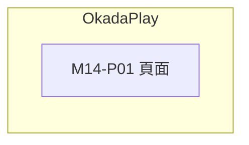

# M14 OkadaPlay(OkadaPlay)— 模塊內容與操作流程(產品)

> 資料來源:後台前端程式(版本 2.8.2)靜態分析,並於 2026-10-05 以人工登入帳號實機只讀查驗(選單依該帳號角色)。各頁查驗結果見 04 測試報告。

## 模塊說明

以內嵌頁面(iframe)開啟 OkadaPlay(playcard.zone)管理後台。

## 頁面一覽

| 頁面 | 名稱 | 類型 | 路由 | 主要操作 |
|---|---|---|---|---|
| M14-P01 | OkadaPlay | 頁面 | `/okadaplay` |  |

## 頁面流程圖

## 頁面內容與操作說明

### M14-P01 OkadaPlay(頁面)

- 路由:`/okadaplay`  權限:`view:okadaplay`
- 功能點:M14-F01 頁面
- 選單位置:✅ 選單;實機狀態:✅ 一致;截圖(本機,不進 git):`.playwright-output/live/okadaplay.png`

