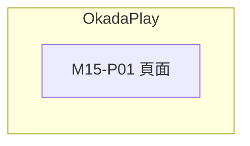

# M15 OkadaPlay(OkadaPlay)— 模塊內容與操作流程(產品)

> 資料來源:後台前端程式(版本 2.8.2)靜態分析,2026-10-05。尚未經登入後實際畫面查驗的內容,狀態標為「待實機查驗」。

## 模塊說明

以內嵌頁面(iframe)開啟 OkadaPlay(playcard.zone)管理後台。

## 頁面一覽

| 頁面 | 名稱 | 類型 | 路由 | 主要操作 |
|---|---|---|---|---|
| M15-P01 | OkadaPlay | 頁面 | `/okadaplay` |  |

## 頁面流程圖

## 頁面內容與操作說明

### M15-P01 OkadaPlay(頁面)

- 路由:`/okadaplay`  權限:`view:okadaplay`
- 功能點:M15-F01 頁面
- 實機狀態:待實機查驗

