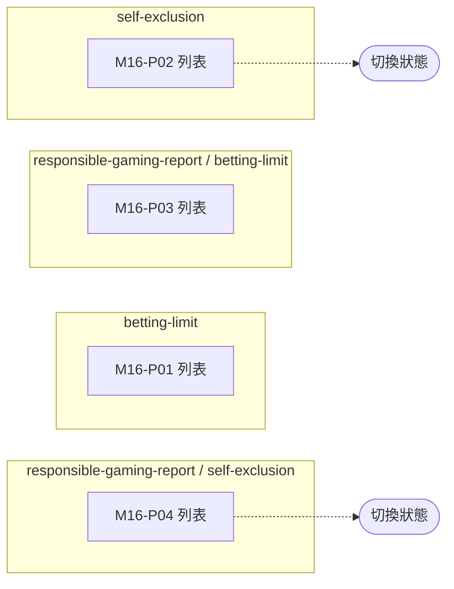

# M16 責任博彩報表(Responsible Gaming)— 模塊內容與操作流程(產品)

> 資料來源:後台前端程式(版本 2.8.2)靜態分析,並於 2026-10-05 以人工登入帳號實機只讀查驗(選單依該帳號角色)。各頁查驗結果見 04 測試報告。

## 模塊說明

責任博彩相關報表:投注限額變更與高使用率名單、自我排除名單(可切換狀態)。

## 頁面一覽

| 頁面 | 名稱 | 類型 | 路由 | 主要操作 |
|---|---|---|---|---|
| M16-P01 | betting-limit | 列表 | `/reports/betting-limit/list` | Clear、Download CSV、Search |
| M16-P02 | self-exclusion | 列表 | `/reports/self-exclusion/list` | Clear、Download CSV、Search |
| M16-P03 | responsible-gaming-report / betting-limit | 列表 | `/responsible-gaming-report/betting-limit/list` | Clear、Download CSV、Search |
| M16-P04 | responsible-gaming-report / self-exclusion | 列表 | `/responsible-gaming-report/self-exclusion/list` | Clear、Download CSV、Search |

## 頁面流程圖

## 頁面內容與操作說明

### M16-P01 betting-limit(列表)

- 路由:`/reports/betting-limit/list`  權限:`view:betting-limit-report`
- 功能點:M16-F01 查詢列表、M16-F02 分頁、M16-F03 匯出
- 表格欄位(實機):Player ID、Limit Period、limit、Usage、Status
- 條件顯示的欄位:Limit Period(Limit Change Report 頁籤)
- 篩選條件:Member ID、Status、Limit Period、Items per page(欄位規則見 03 開發欄位控制)
- 系統提示:「An unexpected error occurred」、「Filters cleared successfully」、「Downloaded successfully」
- 選單位置:❌ 不在選單;實機狀態:✅ 一致;截圖(本機,不進 git):`.playwright-output/live/reports_betting-limit_list.png`

**操作步驟**

1. 從側欄選單進入本頁,系統載入第一頁資料(/report/betting_limit/player、/report/betting_limit/limit_change、/report/betting_limit/high_usage)
2. 輸入篩選條件後按「Search」查詢;按「Clear」清除條件
3. 按「Download CSV / Download」匯出目前查詢結果

### M16-P02 self-exclusion(列表)

- 路由:`/reports/self-exclusion/list`  權限:`view:self-exclusion-report`
- 功能點:M16-F04 查詢列表、M16-F05 欄位排序、M16-F06 分頁、M16-F07 匯出、M16-F08 切換狀態
- 頁面說明:表頭部分寫在頁面內,以實機為準
- 表格欄位(實機):Player ID、Self-Exclusion Start Date、Self-Exclusion End Date、Status、Actions
- 條件顯示的欄位:狀態切換(列表每列)(列表每一列的狀態開關)
- 篩選條件:Member ID、Status、Items per page、狀態切換(列表每列)(欄位規則見 03 開發欄位控制)
- 系統提示:「An unexpected error occurred」、「Filters cleared successfully」
- 選單位置:❌ 不在選單;實機狀態:✅ 一致;截圖(本機,不進 git):`.playwright-output/live/reports_self-exclusion_list.png`

**操作步驟**

1. 從側欄選單進入本頁,系統載入第一頁資料(/report/self_exclusion/list)
2. 輸入篩選條件後按「Search」查詢;按「Clear」清除條件
3. 點欄位標題排序
4. 按「Download CSV / Download」匯出目前查詢結果
5. 切換狀態(POST /report/self_exclusion/toggle_status)

### M16-P03 responsible-gaming-report / betting-limit(列表)

- 路由:`/responsible-gaming-report/betting-limit/list`  權限:`view:betting-limit-report`
- 功能點:M16-F09 查詢列表、M16-F10 分頁、M16-F11 匯出
- 表格欄位(實機):Player ID、Limit Period、limit、Usage、Status
- 條件顯示的欄位:Limit Period(Limit Change Report 頁籤)
- 篩選條件:Player ID、Status、Limit Period、Items per page(欄位規則見 03 開發欄位控制)
- 系統提示:「An unexpected error occurred」、「Filters cleared successfully」、「Downloaded successfully」
- 選單位置:✅ 選單;實機狀態:✅ 一致;截圖(本機,不進 git):`.playwright-output/live/responsible-gaming-report_betting-limit_list.png`

**操作步驟**

1. 從側欄選單進入本頁,系統載入第一頁資料(/report/betting_limit/player、/report/betting_limit/limit_change、/report/betting_limit/high_usage)
2. 輸入篩選條件後按「Search」查詢;按「Clear」清除條件
3. 按「Download CSV / Download」匯出目前查詢結果

### M16-P04 responsible-gaming-report / self-exclusion(列表)

- 路由:`/responsible-gaming-report/self-exclusion/list`  權限:`view:self-exclusion-report`
- 功能點:M16-F12 查詢列表、M16-F13 欄位排序、M16-F14 分頁、M16-F15 匯出、M16-F16 切換狀態
- 頁面說明:表頭部分寫在頁面內,以實機為準
- 表格欄位(實機):Player ID、Self-Exclusion Start Date、Self-Exclusion End Date、Status、Actions
- 條件顯示的欄位:狀態切換(列表每列)(列表每一列的狀態開關)
- 篩選條件:Player ID、Status、Items per page、狀態切換(列表每列)(欄位規則見 03 開發欄位控制)
- 系統提示:「An unexpected error occurred」、「Filters cleared successfully」
- 選單位置:❌ 不在選單;實機狀態:✅ 一致;截圖(本機,不進 git):`.playwright-output/live/responsible-gaming-report_self-exclusion_list.png`

**操作步驟**

1. 從側欄選單進入本頁,系統載入第一頁資料(/report/self_exclusion/list)
2. 輸入篩選條件後按「Search」查詢;按「Clear」清除條件
3. 點欄位標題排序
4. 按「Download CSV / Download」匯出目前查詢結果
5. 切換狀態(POST /report/self_exclusion/toggle_status)

