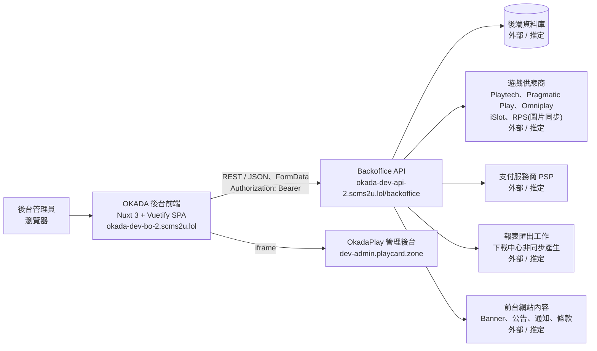
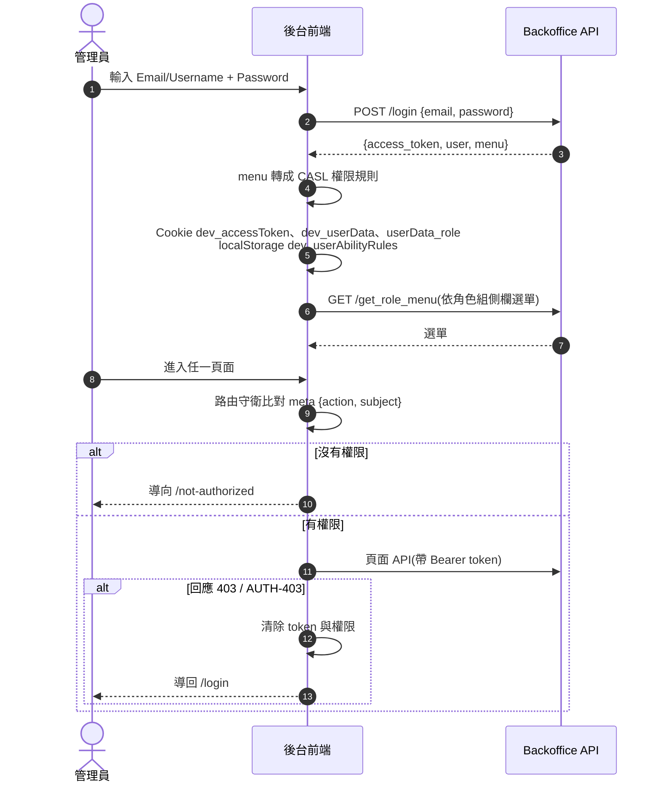
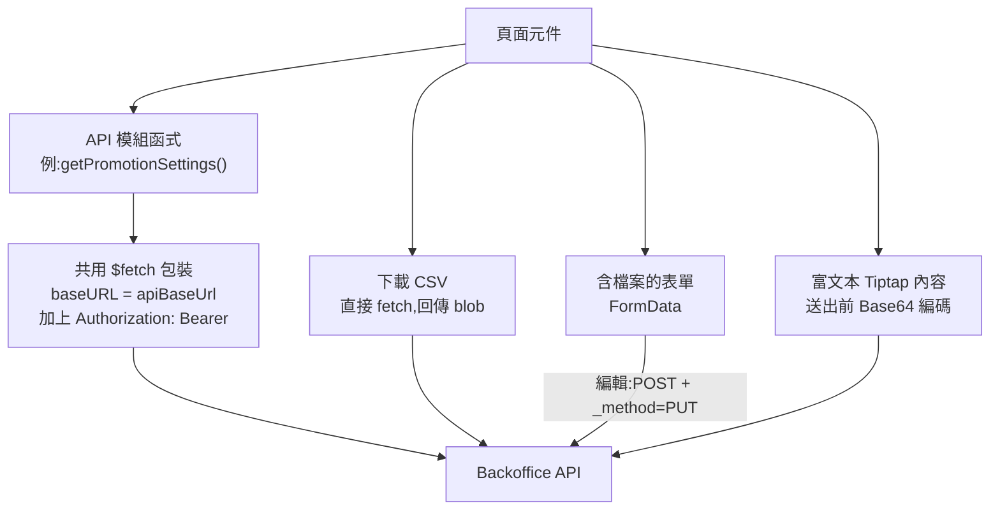
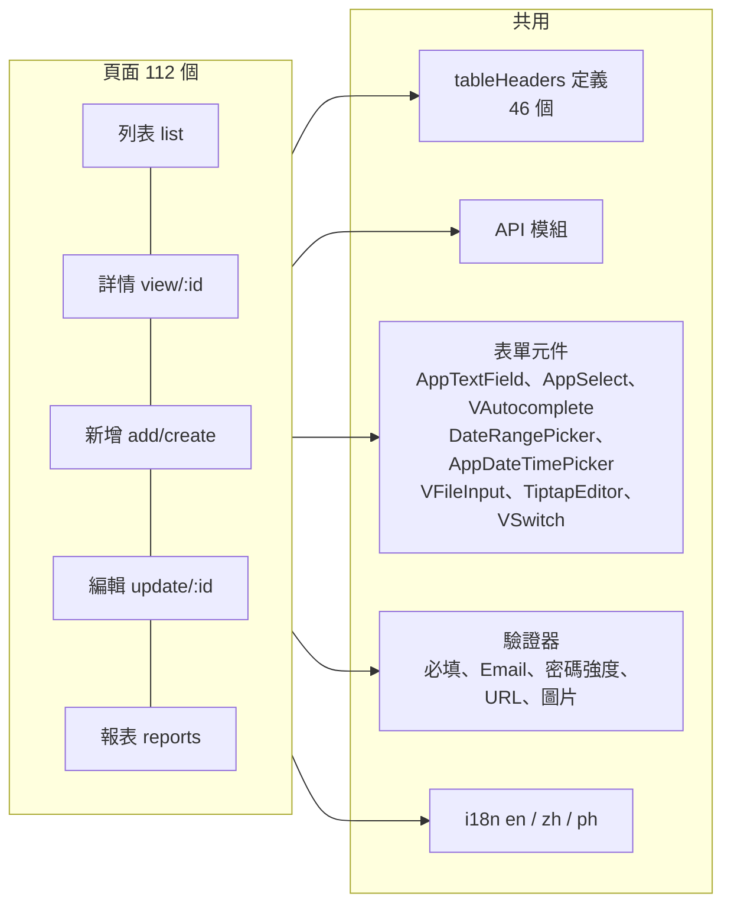
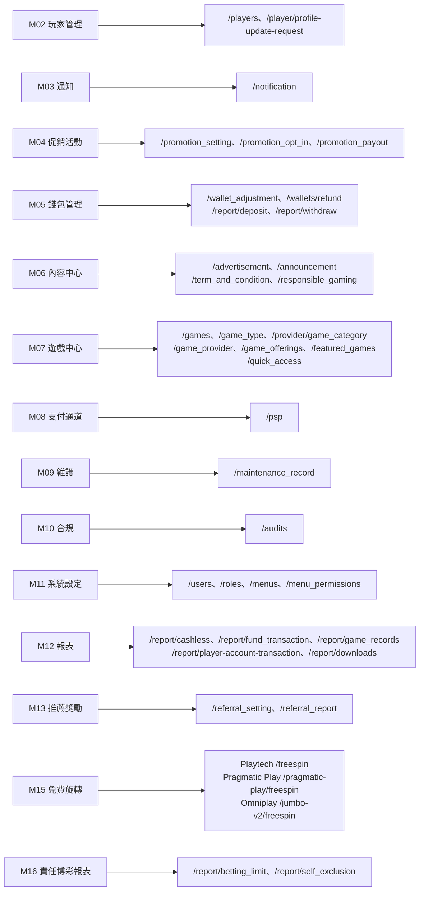

# 系統層面交互架構(開發)

> 資料來源:後台前端程式(版本 2.8.2)靜態分析,並於 2026-10-05 實機只讀查驗(登入流程、選單來源、API 呼叫已對照)。後端內部架構看不到,圖中標「外部 / 推定」的部分只根據前端呼叫的端點推斷,需後端確認。

## 1. 系統全景

| 元件 | 說明 |
|---|---|
| 前端 | Nuxt 3(SPA 模式,`/_nuxt/` 打包)+ Vuetify 3 + vue-i18n + CASL 權限;版本 `appVersion: 2.8.2`,環境 `environment: dev` |
| API | 單一 base URL `https://okada-dev-api-2.scms2u.lol/backoffice`,前端共呼叫約 200 個端點(見 [api.md](api.md)) |
| OkadaPlay | `/okadaplay` 頁以 iframe 開啟 `okadaPlayIframeUrl`,資料不經過本後台 API |
| 多語系 | 內建 en(2,097 個字串)、zh(465)、ph(454);未翻譯的字串回退英文,預設語言 en |

## 2. 登入與權限

- 登入錯誤碼 `AUT-5001` 顯示「Invalid credentials」。
- 另有 `/login-pagcor` 登入頁(PAGCOR 監管單位入口,推定)。
- 權限主體(subject)共 43 個,每個頁面一個 `action:subject`,例如 `create:promotions-settings`;完整對照見 [../01-pm-modules.md](../01-pm-modules.md)。
- 角色權限由「系統設定 → 角色」勾選:`GET /menus`、`GET /menu_permissions` 取得可勾選項目,`PUT /roles/:id/permissions` 儲存。

## 3. 請求管線

| 機制 | 做法 | 例子 |
|---|---|---|
| 列表查詢 | GET + query:`page`、`per_page`、`sort_by`、`order_by` + 篩選欄位 | `GET /promotion_setting?name=&payout_frequency=&start_date=` |
| 新增 | POST;有檔案時用 FormData,否則 JSON | `POST /promotion_setting`、`POST /games` |
| 編輯 | PUT;有檔案時改用 POST + `_method=PUT` | `PUT /psp/:id` |
| 狀態切換 | PUT `.../status/:id` | `PUT /players/status/:id`、`PUT /games/status/:id` |
| 拖曳排序 | PUT `.../sequence/update` | Banner、公告、遊戲分類、精選遊戲、快捷入口 |
| 富文本 | Tiptap 編輯器,HTML 以 Base64 送出 | 公告、通知內容 |
| 匯出 | 直接 `fetch` 下載 blob;部分報表走 `POST /report/export_report` 建立非同步工作,到下載中心取檔 | `GET /{vendor}/freespin/list/download`、`/report/downloads` |
| 錯誤處理 | 顯示後端 `response._data.message`,沒有時顯示預設訊息;失敗不離開頁面 | 各新增/編輯頁 |
| 成功處理 | Snackbar 提示,約 1.5 秒後返回列表 | 各新增/編輯頁 |

## 4. 前端程式結構

驗證器(前端共用):

| 驗證 | 規則 |
|---|---|
| 必填 | 空值、空陣列、false、只有空白 → 錯誤 |
| Email | 標準 Email 格式 |
| 密碼強度 | 至少 8 碼,含大寫、小寫、數字、特殊字元 `!@#$%&*()` |
| 確認密碼 | 必須與密碼相同 |
| URL | `http://` 或 `https://` 開頭 |
| 圖片 | 必填;jpeg / png / webp;≤ 5MB |

## 5. 模塊與 API 網域對應

- Omniplay 的 `{vendor}` 實機為 `jumbo-v2`(`GET /jumbo-v2/freespin/list`)。
- M14 OkadaPlay 是 iframe,不呼叫本後台 API。

## 6. 選單來源(已實機確認)

側欄選單由 `GET /get_role_menu` 回傳 `{menu: [...]}`,每個項目包含 `title`(i18n 鍵)、`icon`、`action`、`subject`、`sequence`、`to`(前端路由名稱)、`children`。前端依此畫出選單;登入帳號的角色決定回傳哪些項目。實機選單結構見 [../01-pm-modules.md](../01-pm-modules.md)。

## 7. 待確認(需後端)

- 後端內部服務、資料庫、與供應商、PSP 的串接方式
- 下載中心的非同步工作流程(排隊、產出、失效時間)
